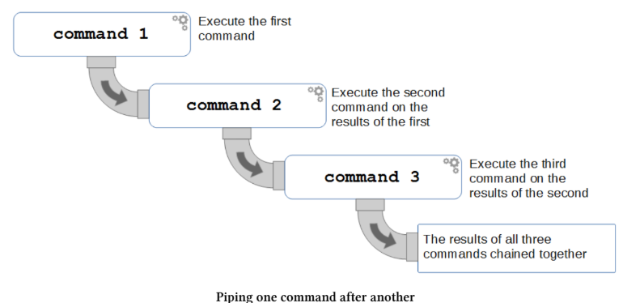
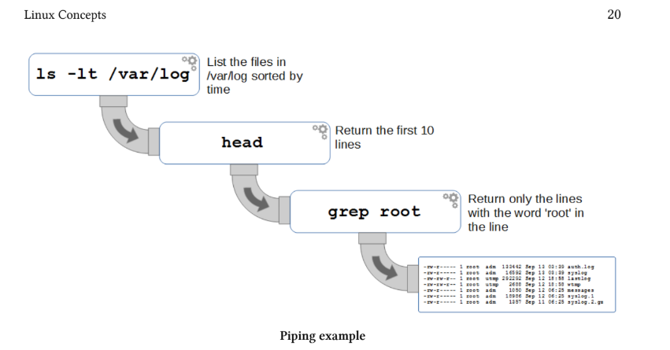

# Commands

## Wildcards

Një koncept i rëndësishëm për t’u kuptuar në Linux është përdorimi i wildcards.

Në një kontekst sportiv, një “wildcard” është një lojtar ose element që mund të përdoret si zëvendësues. Ai nuk ka domosdoshmërisht një rol të fiksuar, por mund të përfaqësojë ose të zëvendësojë një grup të gjerë elementësh standardë.

Në Linux, wildcards janë një veçori e command line, që e bëjnë atë shumë më fleksibël krahasuar me menaxhuesit grafikë të file-ve (file managers). Përdoruesit që kanë provuar kombinime komplekse të tasteve Shift / Ctrl dhe klikime me mouse gjatë organizimit të file-ve në GUI e dinë që kjo mund të bëhet e vështirë dhe jo efikase.

Për shembull, nëse kemi një directory me shumë file dhe subdirectories, dhe duhet të zhvendosim të gjithë file-t Python (me prapashtesën .py) që përmbajnë fjalën “pi” në emër, në një directory tjetër, kjo mund të jetë një detyrë që kërkon shumë kohë në mënyrë manuale.

Në command line në Linux, kjo detyrë bëhet pothuajse aq e thjeshtë sa zhvendosja e një file-i të vetëm. Kjo është e mundur falë wildcards.

Wildcards janë karaktere speciale që lejojnë përzgjedhjen e emrave të file-ve që përputhen me një model (pattern) të caktuar karakteresh. Kjo na mundëson të zgjedhim shumë file njëherësh duke shkruar vetëm disa karaktere.

Në shumicën e rasteve, përdorimi i wildcards është më i shpejtë dhe më efikas sesa përdorimi i një file manager-i grafik.

* Me posht jan wildcards me te perdorurat 
```Wildcard Matches
* zero or more characters
? exactly one character
[abcde] exactly one of the characters listed
[a-e] exactly one character in the range specified
[!abcde] any character that is not listed
[!a-e] any character that is not in the range specified
{pi,raspberry} exactly one entire word from the options given
```

### Shembuj
Zero ose më shumë karaktere
Për të listuar të gjithë skedarët Python që kanë ‘pi’ në emrin e tyre;
```
ls *pi*.py
```

### Saktësisht një karakter
Për të listuar të gjithë skedarët në direktorinë aktuale që kanë një zgjerim me tre karaktere;
```
ls *.???
```

### Saktësisht një nga karakteret e listuara
Për të listuar të gjithë skedarët që kanë një zgjerim që fillon me ‘p’ ose ‘j’;
```
ls *.[pj]*
```

### Saktësisht një karakter në intervalin e specifikuar
Për të listuar të gjithë skedarët që kanë një numër në emrin e skedarit;
```
ls *[0-9]*
```

### Kombinim
Për të listuar të gjithë skedarët që fillojnë me një nga tre shkronjat e para ose tre të fundit të alfabetit dhe përfundojnë me një zgjerim ‘jpg’ ose ‘png’.
```
ls [a-cx-z]*.{jp,pn}g
```

## Regular Expressions
Shprehjet e rregullta (të quajtura gjithashtu ‘regex’) janë një sistem për përputhjen e modeleve që përdor sekuenca karakteresh të ndërtuara sipas rregullave sintaksore të paracaktuara për të gjetur vargjet e dëshiruara në tekst. Tema e shprehjeve të rregullta është një libër më vete dhe rekomandohet fuqimisht lexim i mëtejshëm për ata që kanë nevojë t’i përdorin në praktikë.

Megjithëse wildcard-et përdoren gjerësisht në shprehjet e rregullta dhe në gjuhët e programimit, mbani parasysh se wildcard-et nuk janë pjesë e setit standard të shprehjeve të rregullta. Kjo do të thotë që përpjekja për të përdorur wildcard-e në një terminal nuk do të funksionojë gjithmonë.

Komanda grep (ku “re” në grep qëndron për “regular expression”) është një mjet thelbësor për këdo që përdor Linux, duke lejuar përdorimin e shprehjeve të rregullta në kërkime brenda skedarëve ose në output-et e komandave. Përdorimi i shprehjeve të rregullta është i përhapur në shumë aspekte të operacioneve kompjuterike.

Për shembull, nëse duam të kërkojmë në skedarin dmesg që ndodhet në direktorinë /var/log dhe duam të shfaqim çdo rresht që përmban vargun e karaktereve CPU, do të përdorim komandën grep si më poshtë;
```
grep CPU /var/log/dmesg
```
Output-i nga komanda do të duket i ngjashëm;
```
pi@raspberrypi ~ $ grep CPU /var/log/dmesg
[ 0.000000] Booting Linux on physical CPU 0xf00
[ 0.000000] CPU: ARMv7 Processor [410fc075] revision 5 (ARMv7), cr=10c5387d
[ 0.000000] SLUB: HWalign=64, Order=0-3, MinObjects=0, CPUs=4, Nodes=1
[ 0.004116] CPU: Testing write buffer coherency: ok
[ 0.053503] CPU0: update cpu_capacity 1024
[ 0.053577] CPU0: thread -1, cpu 0, socket 15, mpidr 80000f00
[ 0.113791] CPU1: Booted secondary processor
[ 0.113851] CPU1: update cpu_capacity 1024
[ 0.113860] CPU1: thread -1, cpu 1, socket 15, mpidr 80000f01
[ 0.133710] CPU2: Booted secondary processor
[ 0.133746] CPU2: update cpu_capacity 1024
[ 0.133755] CPU2: thread -1, cpu 2, socket 15, mpidr 80000f02
[ 0.153750] CPU3: Booted secondary processor
[ 0.153788] CPU3: update cpu_capacity 1024
[ 0.153797] CPU3: thread -1, cpu 3, socket 15, mpidr 80000f03
[ 0.153891] Brought up 4 CPUs
[ 0.154045] CPU: All CPU(s) started in SVC mode.
[ 2.406902] ledtrig-cpu: registered to indicate activity on CPUs
```
Ky është një shembull bazë që përdor një varg të thjeshtë për përputhje dhe nuk duhet domosdoshmërisht të konsiderohet si një përdorim i avancuar i shprehjeve të rregullta. Megjithatë, nëse duam të kufizojmë rezultatet e kthyera vetëm në rastet ku vargu është teksti CPU i ndjekur nga numri 0, 1, 2 ose 3, mund të përdorim një shprehje të rregullt me një mekanizëm që përfshin një interval opsionesh. Kjo arrihet duke përdorur kllapat katrore [] me intervalin e specifikuar brenda tyre.

Në rastin tonë duam tekstin CPU dhe ai duhet të pasohet menjëherë nga një numër në intervalin 0 deri në 3. Kjo mund të shprehet me shprehjen e rregullt CPU[0-3].

Kjo do të thotë që kërkimi ynë bëhet si më poshtë;
```
grep CPU[0-3] /var/log/dmesg
```
Do kete rezultatin si me posht;
```
pi@raspberrypi ~ $ grep CPU[0-3] /var/log/dmesg
[ 0.053503] CPU0: update cpu_capacity 1024
[ 0.053577] CPU0: thread -1, cpu 0, socket 15, mpidr 80000f00
[ 0.113791] CPU1: Booted secondary processor
[ 0.113851] CPU1: update cpu_capacity 1024
[ 0.113860] CPU1: thread -1, cpu 1, socket 15, mpidr 80000f01
[ 0.133710] CPU2: Booted secondary processor
[ 0.133746] CPU2: update cpu_capacity 1024
[ 0.133755] CPU2: thread -1, cpu 2, socket 15, mpidr 80000f02
[ 0.153750] CPU3: Booted secondary processor
[ 0.153788] CPU3: update cpu_capacity 1024
[ 0.153797] CPU3: thread -1, cpu 3, socket 15, mpidr 80000f03
```
Kllapat katrore janë “metakaraktere” dhe është përdorimi i këtyre metakaraktereve që i jep shprehjeve të rregullta bazën e fuqisë së tyre.
Më poshtë janë disa nga metakarakteret më të përdorura dhe një përshkrim shumë i shkurtër i efektit të tyre (shembuj do të jepen më vonë);
```
[ ] Përputh çdo karakter brenda kllapave katrore për NJË karakter
^ (caret) Përputhet vetëm në fillim të vargut të synuar (kur nuk përdoret brenda kllapave katrore, ku ka kuptim tjetër)
$ Përputhet vetëm në fund të vargut të synuar
. (pikë) Përputh çdo karakter të vetëm
? Përputhet kur karakteri paraardhës shfaqet 0 ose 1 herë
* Përputhet kur karakteri paraardhës shfaqet 0 ose më shumë herë
+ Përputhet kur karakteri paraardhës shfaqet 1 ose më shumë herë
( ) Mund të përdoren për të grupuar pjesë të shprehjes së kërkimit
| (pipe) Lejon gjetjen e vlerave në anën e majtë ose të djathtë
```

## Pipes (|)

Pipe-t përdoren në Linux për të kombinuar komandat në mënyrë që output-i i një komande të kalojë drejtpërdrejt si input në një komandë tjetër, dhe kështu me radhë. Ideja është të përdoren disa komanda për të krijuar një sekuencë përpunimi të informacionit nga një komandë te tjetra.

Komandat ndahen nga vija vertikale (|), e cila zakonisht gjendet mbi tastin backslash (). Ky është karakteri që përfaqëson funksionin ‘pipe’. Për të kombinuar tre funksione së bashku me simbolin pipe do të kishim diçka si më poshtë;

```
command1 | command2 | command3
```
Siç sugjeron edhe emri, mund ta mendojmë funksionin pipe si komanda të lidhura nga një “tub”, ku një komandë ekzekuton një funksion dhe output-i i saj kalon nëpër këtë tub për të shkuar te komanda e dytë dhe më pas te output-i përfundimtar. Për të ndihmuar në lidhjen vizuale, mund të jetë e dobishme ta imagjinojmë këtë lidhje si më poshtë;




Këtu kemi komandën ls që liston përmbajtjen e direktorisë /var/log me listimin të renditur sipas kohës. Ky output më pas kalon te komanda head, e cila do të shfaqë vetëm 10 rreshtat e parë. Më pas këto 10 rreshta kalojnë te komanda grep, e cila filtron rezultatin për të shfaqur vetëm ato rreshta që përmbajnë fjalën ‘root’.

Komanda, ashtu si do të ekzekutohej nga rreshti i komandës, do të ishte si më poshtë;
```
ls -lt /var/log | head | grep root
```
Rezultati do jete i tille;
```
pi@raspberrypi ~ $ ls -lt /var/log | head | grep root
-rw-r----- 1 root adm 133637 Sep 13 04:01 auth.log
-rw-r----- 1 root adm 16794 Sep 13 04:01 syslog
-rw-rw-r-- 1 root utmp 292292 Sep 12 18:58 lastlog
-rw-rw-r-- 1 root utmp 2688 Sep 12 18:58 wtmp
-rw-r----- 1 root adm 1050 Sep 12 06:25 messages
-rw-r----- 1 root adm 18986 Sep 12 06:25 syslog.1
-rw-r----- 1 root adm 1357 Sep 11 06:25 syslog.2.gz
```