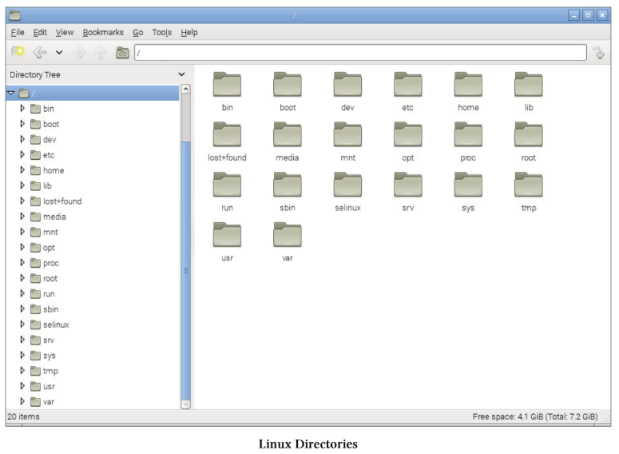
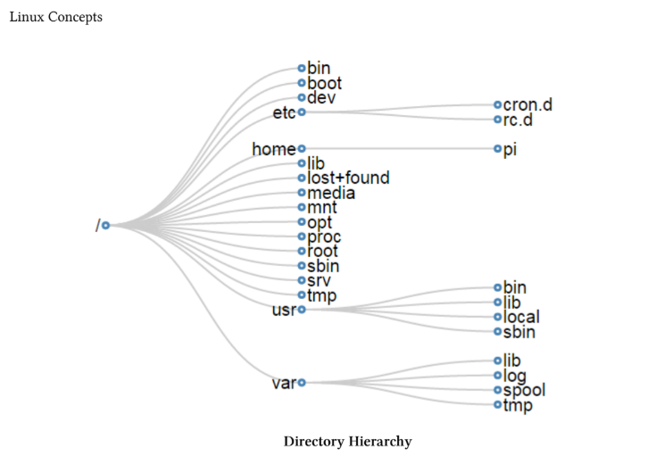

# Linux Directory Structure
Për një përdorues të ri të Linux-it, struktura e skedarëve mund të duket si diçka në rastin më të mirë e ndërlikuar dhe në disa raste arbitrare. Sigurisht, kjo nuk është plotësisht e vërtetë dhe pavarësisht disa ndryshimeve specifike sipas shpërndarjeve, ekziston një hierarki relativisht mirë e organizuar e direktorive dhe skedarëve, me një arsye të mirë për vendin ku ndodhen.

Ne shpesh jemi të rehatshëm me konceptin e navigimit në këtë strukturë duke përdorur një ndërfaqe grafike të ngjashme me atë të paraqitur më poshtë, por për të punuar në mënyrë efektive në linjën e komandës, duhet të kemi njohuri praktike për atë se çfarë ndodhet ku.

## /
Direktoria / ose ‘root’ përmban të gjithë skedarët dhe direktoritë e tjera. Është e rëndësishme të vihet re se kjo nuk është direktoria “home” e përdoruesit root (edhe pse dikur ka qenë shumë vite më parë). Direktoria home e përdoruesit root është /root. Vetëm përdoruesi root ka privilegje shkrimi për këtë direktori.

## /bin
Direktoria /bin përmban ekzekutues binarë / komanda thelbësore për përdorim nga të gjithë përdoruesit. Për shembull: komandat cd, cp, ls, ping, ps. Këto janë komanda që mund të përdoren si nga administratori i sistemit ashtu edhe nga përdoruesit, dhe që kërkohen kur nuk është montuar asnjë filesystem tjetër.

## /boot
Direktoria /boot përmban skedarët e nevojshëm për të nisur me sukses kompjuterin gjatë procesit të boot-imit. Si e tillë, /boot përmban informacion që aksesohet përpara se kernel-i i Linux të fillojë të ekzekutojë programet dhe proceset që lejojnë funksionimin e sistemit operativ.

## /dev
Direktoria /dev mban skedarë pajisjesh që përfaqësojnë pajisje fizike të lidhura me kompjuterin, si hard disqet, pajisjet e zërit dhe portet e komunikimit, si dhe pajisje “logjike” si gjeneratori i numrave rastësor dhe /dev/null, i cili në thelb hedh poshtë çdo informacion të dërguar atje. Kjo direktori përforcon parimin e Linux se “çdo gjë është skedar”.

## /etc
Direktoria /etc përmban skedarë konfigurimi që kontrollojnë funksionimin e programeve. Gjithashtu përmban skripte që përdoren për nisjen dhe ndalimin e programeve individuale.

## /etc/cron.d
Direktoritë /etc/cron.d, /etc/cron.hourly, /etc/cron.daily, /etc/cron.weekly, /etc/cron.monthly përmbajnë skripte që ekzekutohen sipas një orari të rregullt nga procesi crontab.

## /etc/rc?.d
Direktoritë /rc0.d, /rc1.d, /rc2.d, /rc3.d, /rc4.d, /rc5.d, /rc6.d, /rcS.d përmbajnë skedarët e nevojshëm për të kontrolluar shërbimet e sistemit dhe për të konfiguruar mënyrën e funksionimit (runlevel) të kompjuterit.

## /home
Meqenëse Linux është një sistem operativ me mjedis “multi-user”, çdo përdorues ka nevojë për një hapësirë për të ruajtur informacionin e tij. Kjo bëhet përmes direktorisë /home. Për shembull, përdoruesi ‘pi’ do të ketë /home/pi si direktorinë e tij home.

## /lib
Direktoria /lib përmban skedarë bibliotekash të përbashkëta që mbështesin ekzekutuesit e vendosur në /bin dhe /sbin. Gjithashtu mban module të kernel-it (drivers) që i japin Linux-it fleksibilitet për të shtuar ose hequr funksionalitete sipas nevojës.

## /lost+found
Direktoria /lost+found përmban të dhëna potencialisht të rikuperueshme që mund të krijohen nëse filesystem pëson një mbyllje të pasaktë për shkak të crash-it ose ndërprerjes së energjisë. Të dhënat e rikuperuara zakonisht nuk janë të plota ose të padëmtuara, por në disa raste mund të jenë të dobishme.

## /media
Direktoria /media përdoret si pikë e përkohshme për montimin e pajisjeve të lëvizshme (p.sh. /media/cdrom ose /media/cdrecorder). Kjo është një zhvillim relativisht i ri në Linux dhe vjen nga njëfarë konfuzioni historik mbi vendin më të përshtatshëm për montimin e këtyre pajisjeve.

## /mnt
Direktoria /mnt përdoret si një pikë e përgjithshme montimi për filesystem-e ose pajisje. Kohët e fundit përdoret më shumë si pikë e përkohshme nga administratorët e sistemit, por ka variacione historike mes distribucioneve (p.sh. Debian përdor /floppy dhe /cdrom, ndërsa Redhat përdor /mnt/floppy dhe /mnt/cdrom).

## /opt
Direktoria /opt përdoret për instalimin e software-ve të palëve të treta ose opsionale që nuk janë pjesë e instalimit standard. Aplikacionet në këtë zonë duhet të instalohen në mënyrë që të ndjekin një strukturë të rregullt dhe të mos vendosin skedarë jashtë /opt.

## /proc
Direktoria /proc mban skedarë që përmbajnë informacion mbi proceset në ekzekutim dhe burimet e sistemit. Ajo mund të quhet pseudo-filesystem sepse përmban informacion runtime, por jo skedarë “realë” në kuptimin klasik. Për shembull /proc/cpuinfo është 0 bytes, por shfaq informacion real për CPU-t.

## /root
Direktoria /root është direktoria home e administratorit të sistemit (root user). Kjo mund të duket pak konfuze sepse të gjitha home directories të përdoruesve të tjerë janë në /home dhe ekziston edhe direktoria “root” (/). Megjithatë kjo është bërë për arsye historike dhe praktike.

## /sbin
Direktoria /sbin është e ngjashme me /bin në kuptimin që përmban ekzekutues binarë, por ato janë të domosdoshme për funksionimin e sistemit dhe përdoren kryesisht nga administratori i sistemit për mirëmbajtje. Shembuj: fdisk, shutdown, ifconfig, modprobe.

## /srv
Direktoria /srv përdoret për ruajtjen e të dhënave të shërbimeve specifike. Ideja është që shërbimet që kërkojnë një vend të vetëm dhe strukturë të unifikuar për të dhëna dhe skripte të kenë vendosje të qëndrueshme në sistem.

## /tmp
Direktoria /tmp përdoret si vend për ruajtje të përkohshme nga programet ose përdoruesit. Kur sistemi riniset ose fiket, kjo direktori pastrohet dhe përmbajtja fshihet.

## /usr
Direktoria /usr shërben si vend ku ruhen dhe ndahen programet dhe të dhënat e përdoruesve. Për shkak të volumit të madh të të dhënave, ajo përmban disa nën-drejtori që imitojnë strukturën e root (/).

## /usr/bin
Direktoria /usr/bin përmban ekzekutues për përdoruesit. Dallimi mes /bin dhe /usr/bin është se /bin përmban komandat esenciale për sistemin, ndërsa /usr/bin përmban programet për përdorim normal të përdoruesve (p.sh. awk, curl, php, python).

## /usr/lib
Direktoria /usr/lib është ekuivalente me /lib dhe përmban bibliotekat që mbështesin programet në /usr/bin dhe /usr/sbin.

## /usr/local
Direktoria /usr/local përmban programe të instaluara lokalisht nga kodi burim. Përdoret që të mos mbishkruhet gjatë përditësimeve të sistemit.

## /usr/sbin
Direktoria /usr/sbin përmban ekzekutues jo thelbësorë për administratorin e sistemit, si cron dhe useradd. Nëse nuk gjendet një komandë këtu, mund të kërkohet në /sbin.

## /var
Direktoria /var përmban skedarë të dhënash që ndryshojnë vazhdimisht, si log files ose radhë printimi.

## /var/lib
Direktoria /var/lib mban informacion dinamik të gjendjes që programet e modifikojnë gjatë ekzekutimit. Kjo përdoret për të ruajtur gjendjen e aplikacioneve mes rinisjeve.

## /var/log
Direktoria /var/log mban log files nga shërbime dhe programe të ndryshme. Këto skedarë mund të rriten shumë dhe duhet menaxhuar me kujdes, p.sh. me logrotate.

## /var/spool
Direktoria /var/spool përmban skedarë “spool” që mbajnë të dhëna për përpunim të mëvonshëm, si print jobs që presin radhën për printim.

## /var/tmp
Direktoria /var/tmp është ruajtje e përkohshme për të dhëna që duhet të mbahen edhe pas rinisjes së sistemit (ndryshe nga /tmp).