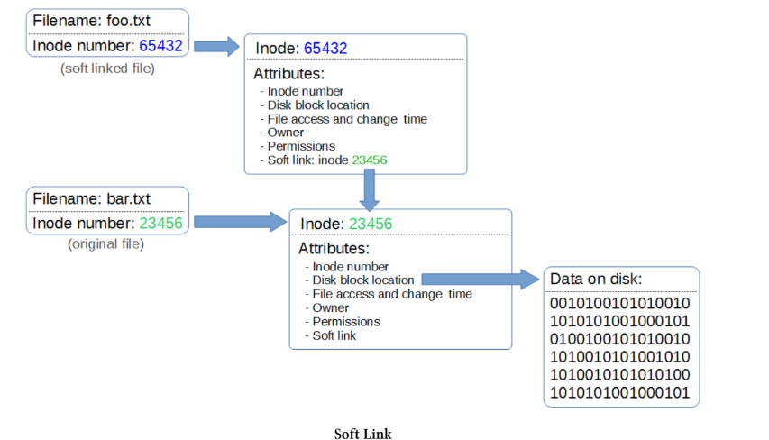
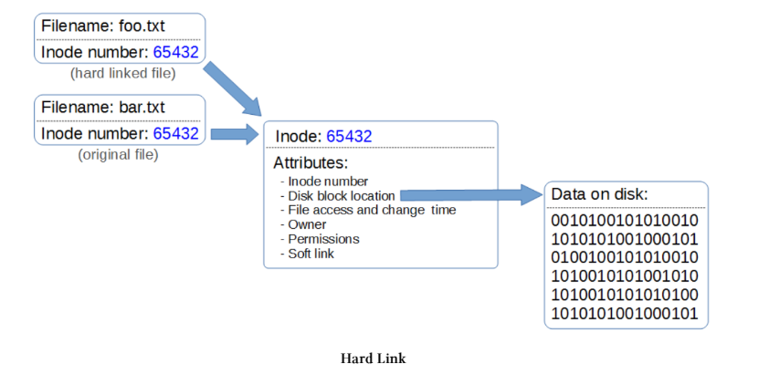

# Linux files and inodes
Duke qenë se kemi vendosur që “çdo gjë është një skedar” në një sistem operativ Linux, përfundojmë në situatën ku skedarët bëhen papritur pak më interesantë dhe misteriozë, dhe është e dobishme të kemi një kuptim më të mirë se si përfaqësohen skedarët në Linux, në mënyrë që të kuptohet më mirë konteksti i funksioneve të tjera (p.sh. links).

Skedarët në Linux mund të kuptohen më mirë duke i menduar si të përshkruar nga tre pjesë;

* Emri i skedarit
* Një inode
* Të dhënat

## The file name

Emrat individualë të skedarëve zakonisht kufizohen në 255 karaktere dhe mund të përbëhen nga pothuajse çdo kombinim karakteresh. I vetmi karakter “special” ose i rezervuar gjatë caktimit të emrit të skedarit është slash-i përpara (/). Ky karakter përdoret vetëm për të ndarë direktoritë dhe emrat e skedarëve sipas rastit.

Përbërësi tjetër i një emri skedari është një numër inode. Ky është një numër i caktuar nga sistemi operativ që vepron si një tregues drejt një inode (Index Node), i cili është një objekt që mund të mendohet si një hyrje në një databazë që ruan informacion specifik për atë skedar.

Mund të listojmë numrat inode të lidhur me skedarët duke përdorur opsionin -i gjatë listimit të skedarëve. Për shembull;

```
ls -i python_games/
```

Output-i (i paraqitur në formë të shkurtuar më poshtë) tregon;

```
pi@raspberrypi ~ $ ls -i python_games/
45014 4row_arrow.png 63554 inkspillresetbutton.png
49906 4row_black.png 63556 inkspillsettingsbutton.png
54215 4row_red.png 63559 match0.wav
63530 cat.png 63569 princess.png
63533 drawing.py 63488 RedSelector.png
63544 gem6.png 63576 star_title.png
63545 gem7.png 63578 tetrisb.mid
63546 gemgem.py 63579 tetrisc.mid
63553 inkspilllogo.png 63522 Wood_Block_Tall.png
63552 inkspill.py 63582 wormy.py
```
Numrat në të majtë të emrave të skedarëve janë numrat inode përkatës.
Emri i skedarit dhe inode përkatëse ndodhen në direktorinë ku gjendet skedari. Çdo direktori (e cila vetë është thjesht një skedar) përmban një tabelë të skedarëve që ajo mban me numrat inode përkatës.


### Inode

Çdo skedar ka një inode (index node) të lidhur me të. Inode mund të mendohet si një hyrje në një databazë që përshkruan një sërë atributesh të skedarit. Këto atribute përfshijnë;
* Numrin unik të inode
* Access Control List (ACL)
* Atribute të zgjeruara si vetëm-append ose pandryshueshmëri (immutability)
* Vendndodhjen e blloqeve në disk
* Numrin e blloqeve
* Kohën e aksesit, ndryshimit dhe modifikimit të skedarit
* Kohën e fshirjes së skedarit
* Numrin e gjenerimit të skedarit
* Madhësinë e skedarit
* Llojin e skedarit
* Grupin
* Numrin e lidhjeve (links)
* Pronarin (owner)
* Lejet (permissions)
* Flamujt e statusit (status flags)

Mund të pyesim me të drejtë çfarë kuptimi ka përdorimi i inode-ve të numëruara. Pyetje e mirë. Ato kanë disa përdorime, përfshirë kur ka skedarë për t’u fshirë me emra kompleksë që nuk mund të riprodhohen lehtësisht në terminal, ose për të mundësuar linking.
Interesant është fakti që hapësira për inode duhet të caktohet kur instalohet një sistem operativ. Brenda çdo file-system, numri maksimal i inode-ve, dhe rrjedhimisht numri maksimal i skedarëve, përcaktohet kur krijohet file-system-i.
Prandaj ekzistojnë dy mënyra se si një file-system mund të mbetet pa hapësirë;


    * Mund të konsumojë gjithë hapësirën për shtimin e të dhënave të reja (pra të mbushet disku), ose
    * Mund të përdorë të gjitha inode-t


Mbarimi i inode-ve do ta ndalojë plotësisht kompjuterin, sepse nuk mund të krijohen më skedarë të rinj, edhe nëse ka ende hapësirë në hard disk. Është veçanërisht e lehtë të mbeten pa inode nëse file-system-i përmban një numër shumë të madh skedarësh të vegjël.
## Links
Një link në sistemin e skedarëve Linux ofron një mekanizëm për krijimin e një lidhjeje midis skedarëve. Edhe pse mund të krahasohen me “shortcuts” në Windows, kjo nuk është plotësisht e saktë, pasi linking në Linux ka shumë më tepër funksionalitet.
Për të kuptuar më mirë përshkrimin e links, duhet të jemi të njohur në mënyrë të përgjithshme me diskutimin e mëparshëm mbi skedarët dhe inode-t. Duhet të kujtojmë se një skedar në Linux përbëhet nga tre pjesë;

* Emri i skedarit dhe numri i tij përkatës inode
* Një inode që përshkruan atributet e skedarit
* Të dhënat e lidhura me skedarin

Emri i skedarit dhe inode number tregojnë drejt një inode që përmban të gjithë informacionin për skedarin dhe më pas kjo inode tregon drejt të dhënave të ruajtura në hard disk.
Links mund të identifikohen kur listohen skedarët me ls -l nga një l që shfaqet si karakteri i parë në listim për skedarin dhe nga shigjeta (->) në fund që tregon lidhjen. Për shembull, duke ekzekutuar komandën e mëposhtme të listimit, mund të shohim (mes shumë skedarëve të tjerë) që skedari /etc/vtrgb është një link drejt skedarit /etc/alternatives/vtrgb.

```
drwxr-xr-x 2 root root 4096 Apr 17 2014 vim
lrwxrwxrwx 1 root root 23 Jul 10 07:45 vtrgb -> /etc/alternatives/vtrgb
-rw-r--r-- 1 root root 4812 Feb 8 2014 wgetrc
drwxr-xr-x 2 root root 4096 Jul 10 08:04 wildmidi
```

### Soft Links (aka symbolic links, aka symlinks)

Një soft link mund të quhet gjithashtu symbolic link, por më shpesh quhet “symlink”. Një symlink ka një emër skedari dhe një numër inode që tregon drejt inode-it të vet, por në inode-in e tij ekziston një path që ridrejton drejt një inode tjetër, i cili më pas tregon drejt një blloku të dhënash.

Meqenëse inode-t janë të kufizuara në particionin në të cilin krijohen, një symbolic link lejon ridrejtimin drejt një path-i që mund të kalojë nëpër particione të ndryshme.

Nëse editojmë skedarin e lidhur, skedari origjinal do të modifikohet. Nëse fshijmë skedarin e lidhur, skedari origjinal nuk do të fshihet. Por nëse fshijmë skedarin origjinal pa fshirë link-un, do të mbetet një link i “jetim” (orphaned link).

Soft links mund të lidhin si direktori ashtu edhe skedarë, por nëse skedari zhvendoset, link-u nuk do të funksionojë më.

### Hard Links
Një hard link është ai rast kur më shumë se një emër skedari lidhet me të njëjtin inode.

Kjo do të thotë që dy emra skedarësh në thelb po ndajnë të njëjtin inode dhe të njëjtat blloqe të dhënash, megjithatë ata do të sillen si skedarë të pavarur. Për shembull, nëse më pas fshijmë njërin prej skedarëve, lidhja ndërpritet, por inode dhe blloku i të dhënave do të mbeten derisa të fshihen të gjithë emrat e skedarëve që lidhen me atë inode.
Hard links lidhen vetëm me një skedar (jo me direktori), nuk mund të kalojnë nëpër particione të ndryshme dhe do të vazhdojnë të lidhen me një skedar edhe nëse ai zhvendoset.

### Krahasimi i Links
#### Hard links
    • Lidhin vetëm me një skedar (jo direktori)
    • Nuk lidhin skedarë në hard disk / particione të ndryshme
    • Vazhdon të lidhen me skedarin edhe kur ai zhvendoset
    • Lidhen me një inode dhe një vend fizik në disk
#### Soft links (ose symbolic links / symlinks)
    • Mund të lidhen si me direktori ashtu edhe me skedarë
    • Mund të lidhen me skedarë ose direktori në hard disk / particione të ndryshme
    • Link-u mbetet edhe nëse skedari origjinal fshihet
    • Link-u nuk lidhet më me skedarin nëse ai zhvendoset
    • Lidhen përmes koncepteve abstrakte (prandaj “symbolic”), jo përmes vendndodhjes fizike në disk. Ata kanë inode-in e tyre