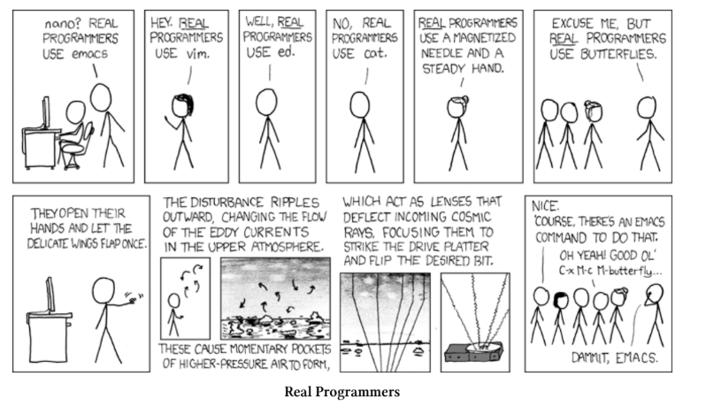
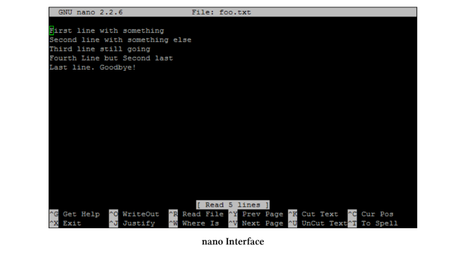
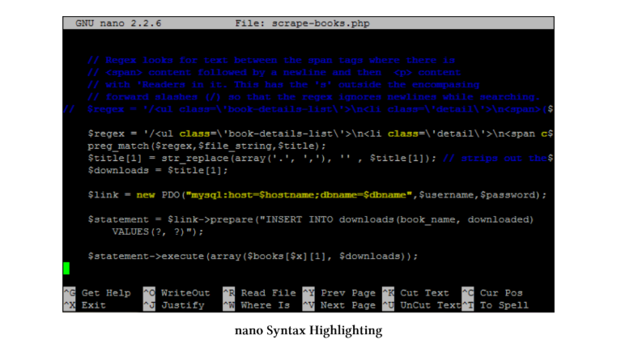

# File Editing
Puna në Linux është në thelb një proces për të kuptuar disa ide bazë si “çdo gjë është skedar”, përdorimi i wildcards, pipes dhe struktura e direktorive.
Kur fillon të punosh në terminal, shumë shpejt e kupton që ke nevojë të dish si të redaktosh (edito) një skedar. Linux ka shumë mënyra për ta bërë këtë, sepse është shumë fleksibël.
Ka madje edhe humor për këtë në internet, për shembull në strip-in e famshëm xkcd, që tregon se sa “komplekse” mund të jenë zgjedhjet e editorëve.

Në praktikë, ka shumë editorë të ndryshëm për të punuar me skedarë. Si në çdo gjë ku ka zgjedhje, ka edhe preferenca personale dhe shpesh edhe “fanatizma” për një mjet të caktuar. Çdo njeri ka editorin e vet të preferuar dhe nuk duhet të ndikohesh nga të tjerët pa i provuar vetë alternativat.
Për shembull, shumë njerëz përdorin “vi” sepse është shumë i fuqishëm dhe i përdorur nga profesionistët, por për dikë që sapo fillon mund të jetë i vështirë për t’u mësuar. Edhe unë kam pasur vështirësi me të dhe nuk e kam mësuar mirë.
Për një kohë kam përdorur editorë grafikë si “gedit” ose “geany”, por më vonë zbulova “nano”, i cili është shumë më i thjeshtë për t’u përdorur.
Prandaj unë preferoj nano, por kjo është vetëm zgjedhje personale. Nuk ka një editor “më të mirë për të gjithë”. E rëndësishme është të provosh disa dhe të zgjedhësh atë që të përshtatet më shumë ty.

## The nano Editor
Editor-i nano mund të hapet nga linja e komandës thjesht duke përdorur komandën dhe path-in/emrin e skedarit.

    nano foo.txt

Nëse skedari kërkon leje administratori, ai mund të hapet duke përdorur ‘sudo’.

    sudo nano foo.txt

Kur hapet, ai na paraqet një hapësirë pune ku shfaqet një pjesë e skedarit dhe në fund të terminalit shfaqen disa shkurtesa (shortcuts) të zakonshme për përdorim.

Ai përfshin edhe një theksim të thjeshtë të sintaksës (syntax highlighting) për disa formate të zakonshme skedarësh.

Kjo mund të përmirësohet nëse dëshirojmë (kërko në Google).
Ka shumë shkurtore (shortcuts) për ta bërë editimin më të lehtë, por më të thjeshtat janë si më poshtë:

     CTRL-x – Dil nga editori. Nëse jemi duke edituar një skedar, do të pyetemi nëse duam ta ruajmë punën tonë
    CTRL-r – Lexo një skedar brenda skedarit aktual. Kjo na lejon të shtojmë tekst nga një skedar tjetër gjatë punës
    CTRL-k – Pres (cut) tekstin
    CTRL-u – Ngjit (paste) tekstin e prerë
    CTRL-o – Ruaj skedarin dhe vazhdo punën
    CTRL-t – Kontrollo drejtshkrimin e tekstit
    CTRL-w – Kërko brenda tekstit
    CTRL-a – Shko në fillim të rreshtit aktual
    CTRL-e – Shko në fund të rreshtit aktual
    CTRL-g – Merr ndihmë për nano