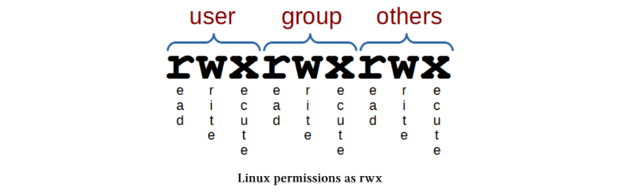

# Scripting

Një shell script është një skedar që përmban një seri komandash. Procesi i scripting është shkrimi i këtyre komandave brenda atij skedari. Shell-i mund ta lexojë këtë skedar dhe t’i ekzekutojë komandat sikur të ishin shkruar drejtpërdrejt në tastierë.
Duke qenë se ka shumë komanda të disponueshme, mund të shfrytëzojmë fuqinë reale të kompjuterit dhe të ulim punët e përsëritura duke automatizuar procese.
Mund t’i mendojmë shell script-et si komanda të lidhura së bashku që sistemi i ekzekuton si një veprim i programuar. Ato përdorin funksione si zëvendësimi i komandave (command substitution), ku mund të thërrasim një komandë si date dhe të përdorim output-in e saj, për shembull në emërtimin e skedarëve. Script-et janë programe më vete që përdorin elemente programimi si cikle (loops), variabla dhe struktura if/then/else. E mira e scripting është se nuk kemi nevojë të mësojmë një gjuhë të re programimi, por përdorim komandat që tashmë i përdorim në terminal.
Për të krijuar me sukses një script që kryen një detyrë, duhet të bëjmë tre gjëra;


    1.Të shkruajmë script-in (një skedar me prapashtesën ‘.sh’) duke përdorur komanda të zakonshme

    2.Të vendosim lejet (permissions) që skedari të mund të ekzekutohet

    3.Ta vendosim skedarin në një vend ku shell-i mund ta gjejë kur ta thërrasim

## Writing our Script

Script-i vetë është thjesht një skedar teksti. E vetmja gjë e veçantë është se përmban komanda dhe ne do ta bëjmë të ekzekutueshëm.
Mund të fillojmë me një shembull të thjeshtë që tregon si të shfaqim një mesazh në ekran duke përdorur echo. Duke qenë në direktorinë tonë home (/home/pi), mund të përdorim editorin nano për të krijuar script-in me komandën;

```
nano sayhello.sh
```

Kjo do të hapë editorin nano dhe mund të shkruajmë diçka të tillë;

```
#!/bin/bash
# Hello World Script
echo "Hello World!"
```
Rreshti i parë i script-it është i rëndësishëm sepse i tregon shell-it se cili program duhet të përdoret për ta interpretuar dhe ekzekutuar script-in. Ky rresht fillon me “shebang” (#!) dhe më pas vjen path-i i programit (në këtë rast /bin/bash).
Rreshti i dytë është një koment që vendoset në script për t’i treguar vetes ose të tjerëve se çfarë bën ai skedar. Çdo gjë që vjen pas simbolit # (përveç rreshtit të parë me “shebang”) injorohet nga script-i dhe shërben vetëm si shënim për lexuesin.
Rreshti i fundit është komanda që do të ekzekutohet. Në këtë rast është vetëm një komandë, por mund të ketë edhe shumë të tjera. Këtu përdoret një komandë e thjeshtë echo për të shfaqur tekstin “Hello World!” në ekran.
Pasi të kemi mbaruar, mund ta mbyllim dhe ruajmë skedarin (CTRL-x për ta mbyllur dhe shtypim ‘y’ për ta ruajtur);
Kaq, script-i ynë u krijua.

## Make the script executable

Nëse shohim vetitë e skedarit tonë sayhello.sh me komandën ls si më poshtë;

    ls -l sayhello.sh

… do të shohim detajet e skedarit diçka të tillë;

    -rw-r--r-- 1 pi pi 54 Feb 17 17:18 sayhello.sh

Lejet (permissions) në Linux përcaktojnë çfarë mund të bëjë përdoruesi pronar, çfarë mund të bëjnë anëtarët e grupit dhe çfarë mund të bëjnë përdoruesit e tjerë me atë skedar. Për çdo përdorues, duhen tre “bit” për të përcaktuar lejet: i pari për lexim (r), i dyti për shkrim (w) dhe i treti për ekzekutim (x).

Gjithashtu kemi tre nivele pronësie: ‘user’, ‘group’ dhe ‘others’, kështu që kemi një treshe për secilin (tre grupe me nga tre), duke rezultuar në nëntë “bit” gjithsej.

Diagrami i mëposhtëm tregon se si përfaqësohen këto leje në një sistem Linux kur user, group dhe others kanë të gjitha lejet: lexim, shkrim dhe ekzekutim;
 


Lejet e skedarit tonë sayhello.sh tregojnë se përdoruesi mund ta lexojë dhe ta modifikojë skedarin, ndërsa anëtarët e grupit dhe përdoruesit e tjerë mund vetëm ta lexojnë atë. Ajo që duhet të bëjmë është ta bëjmë skedarin të ekzekutueshëm duke përdorur komandën chmod.

    chmod 755 sayhello.sh

Nëse e kontrollojmë përsëri me ls -l sayhello.sh, duhet të shohim diçka të ngjashme me këtë;

    -rwxrwxr-x 1 pi pi 54 Feb 17 17:18 sayhello.sh

Këtu të gjithë kanë leje për ekzekutim, ndërsa përdoruesi ‘pi’ dhe grupi ‘pi’ kanë leje për lexim dhe shkrim.

## Place the script somewhere that the shell can find it

Aktualisht po punojmë në direktorinë “home” të përdoruesit ‘pi’, ku kemi ruajtur skedarin tonë. Ky është rasti më i thjeshtë për ta bërë script-in të aksesueshëm dhe mund ta ekzekutojmë direkt nga linja e komandës si më poshtë;

    ./sayhello.sh

Output-i nga komanda duhet të duket diçka si kjo;

    Hello World!

Shenja ./ përpara script-it tregon që path-i i skedarit është direktoria aktuale ku ndodhemi. Mund të përdorim edhe path-in e plotë si më poshtë;

    /home/pi/sayhello.sh

(meqë /home/pi/ është direktoria ku ndodhet skedari.)

Kjo funksionon, por në një situatë ideale nuk do të na duhej të specifikonim path-in për ta ekzekutuar script-in. Këtë mund ta arrijmë duke e vendosur script-in në një nga direktoritë që ndodhen në ‘PATH’ të përdoruesit.

PATH është një variabël mjedisi (environment variable) që i tregon shell-it se cilat direktori duhet të kërkojë për skedarë të ekzekutueshëm. Nuk duhet ngatërruar me termin ‘path’, i cili i referohet adresës së një skedari ose direktorie në sistemin e skedarëve.

PATH-i i një përdoruesi përbëhet nga disa path-e absolute të ndara me dy pika (:). Kur shkruajmë një komandë në terminal që nuk ka path absolut, shell-i kërkon nëpër këto direktori derisa të gjejë një skedar të ekzekutueshëm me atë emër.

Mund të shohim PATH-in duke përdorur;

    echo $PATH

Kjo do të shfaqë diçka si;

    /usr/local/sbin:/usr/local/bin:/usr/sbin:/usr/bin:/sbin:/bin

Kjo do të thotë që nëse vendosim script-in tonë në një nga këto direktori, ai do të funksionojë si një komandë normale. Por kjo e bën të aksesueshëm për të gjithë përdoruesit. Nëse duam ta kemi vetëm për veten tonë, duhet të shtojmë një path të ri në PATH.

Lajmi i mirë është që kjo është e thjeshtë. Në Debian Jessie mjafton të krijojmë një direktori me emrin bin brenda direktorisë sonë home (p.sh. /home/pi);

    mkdir ~/bin

Pastaj mund të vendosim çdo script që duam në këtë direktori dhe do të jetë i aksesueshëm për përdoruesin ‘pi’. Kjo funksionon sepse ekziston një skedar .profile që kontrollohet sa herë që hapet bash shell. Nëse ai gjen një direktori bin në home, e shton automatikisht në PATH.

Mos harrojmë të zhvendosim script-in tonë në këtë direktori;

    mv ~/sayhello.sh ~/bin/

Pas hapjes së një terminali të ri dhe hyrjes si përdoruesi ‘pi’, mund të jemi në çdo direktori (me cd) dhe thjesht të ekzekutojmë;

    sayhello.sh

… dhe do të marrim;

    Hello World!

Kjo përfundon shembullin tonë të parë të thjeshtë. Pjesa më e avancuar me loops, variabla dhe if/then/else mbetet për t’u eksploruar më tej. Shpresojmë që kjo të jetë “mjaftueshëm” për të filluar.
 


