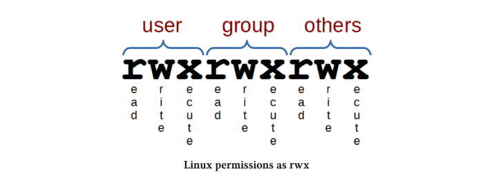
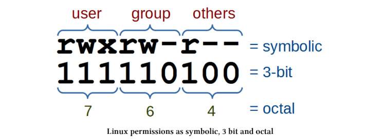
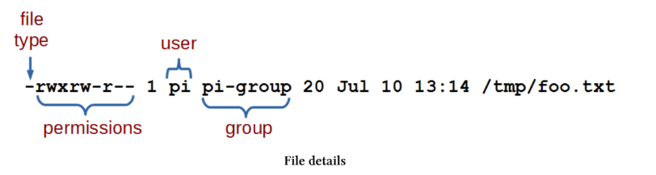

# cd

Komanda cd përdoret për të lëvizur nëpër strukturën e direktorive në sistemin e skedarëve (change directory). Është një nga komandat bazë për navigim në Linux.

    cd [options] directory : Përdoret për të ndryshuar direktorinë aktuale.

Për shembull, kur hyjmë në Raspberry Pi si përdoruesi ‘pi’, zakonisht ndodhemi në direktorinë /home/pi. Nëse duam të kalojmë në direktorinë /home (një nivel më lart), mund të përdorim;

    cd /home

Merr pak kohë për t’u familjarizuar me lëvizjen nëpër direktorive nga linja e komandës, sepse është një aftësi shumë e rëndësishme në Linux.

## The cd command

Komanda cd është ndër të parat që përdor një fillestar në Linux. Ajo përdoret për të lëvizur në strukturën e direktorive (pra cd = change directory).

Ka vetëm dy opsione dhe ato përdoren rrallë. Argumentet e saj janë thjesht direktoria ku duam të shkojmë dhe mund të jenë path absolut ose relativ.

Komanda cd mund të përdoret edhe pa opsione ose argumente. Në këtë rast, ajo na kthen në direktorinë “home” të përdoruesit, siç është e përcaktuar në skedarin /etc/passwd.

Nëse kalojmë në një direktori tjetër (p.sh. cd /var) dhe më pas ekzekutojmë vetëm cd;

    cd

… në një instalim standard të Raspbian, do të kthehemi në /home/pi.

    pi@raspberrypi ~ $ cd /var
    pi@raspberrypi /var $ cd
    pi@raspberrypi ~ $ pwd
    /home/pi

Në shembullin më sipër, kaluam në /var, pastaj përdorëm cd vetëm dhe më pas pwd, që tregoi se direktoria aktuale është /home/pi, që është home default për përdoruesin ‘pi’.

## Options

Siç u përmend, ekzistojnë vetëm dy opsione për komandën cd:

    -P → përdor strukturën fizike të direktorive (pa ndjekur symbolic links)
    -L → ndjek symbolic links

Për fillestarët, ka shumë pak gjasa të përdoren këto opsione në fillim, ndaj është më mirë të fokusoheni te komandat e tjera bazë.

## Arguments

Siç u përmend më parë, nëse nuk jepet asnjë argument, cd të kthen në direktorinë home të përdoruesit.

Kur specifikojmë një direktori, mund të përdorim path absolut ose relativ. Për shembull, nëse jemi në /home/pi, mund të shkojmë në /home kështu;

    cd /home

Ose me adresim relativ duke përdorur .. për direktorinë prind;

    cd ..

Pasi jemi në /home, mund të kalojmë në /home/pi/Desktop me adresim relativ;

    cd pi/Desktop

Gjithashtu mund të përdorim argumentin - për t’u kthyer në direktorinë e mëparshme.

## Examples

Ndrysho në direktorinë root (/);

    cd /

==============================

# chgrp

Komanda chgrp përdoret për të ndryshuar grupin pronar të një skedari ose direktorie. Në këtë kuptim është shumë e ngjashme me komandën chown, por përdoret vetëm për ndryshimin e grupit, jo të përdoruesit.
    
    • chgrp [options] group files : Ndryshon grupin për një ose më shumë skedarë/direktori

Për shembull, komanda më poshtë (zakonisht përdoret me sudo) vendos grupin “users” për direktorinë /srv/shared. Lejet e këtij grupi do të vlejnë për të gjithë përdoruesit që janë pjesë e grupit “users”. Shpesh përdoret edhe chmod për të rregulluar lejet e grupit.
    
    chgrp users /srv/shared

Mund ta verifikojmë me ls -l:

    pi@raspberrypi ~ $ ls -l
    total 4
    drwxr-xr-x 2 root users 4096 Jul 18 21:24 shared

Në këtë fazë, anëtarët e grupit “users” mund të lexojnë dhe të shohin përmbajtjen e direktorisë /srv/shared.
Nëse shtojmë lejen e shkrimit për grupin me chmod g+w, atëherë çdo përdorues në grupin “users” mund të shkruajë në këtë direktori.
Ky proces është i dobishëm për krijimin e një direktorie të përbashkët ku përdoruesit mund të ndajnë të dhëna.

## The command
Emri chgrp është shkurtim për “change group”. Siç mund të kujtoni, chown mund të ndryshojë edhe grupin, por chgrp është një mënyrë më e thjeshtë dhe e shpejtë kur duam të ndryshojmë vetëm grupin.

## Options
Opsioni më i përdorur me chgrp është:

    -R → ndryshon grupin në mënyrë rekursive (pra për direktorinë dhe gjithë përmbajtjen e saj)

Një tjetër opsion është:

    --reference → vendos grupin e një skedari të njëjtë me atë të një skedari tjetër


## Shembull:
    chgrp --reference=file1.txt file2.txt

## Arguments
Komanda chgrp është e thjeshtë për t’u përdorur. Emri i grupit vendoset i pari, pastaj skedarët ose direktoritë që duam të ndryshojmë.
chgrp groupname file1 file2 ...

## Examples
Ndrysho grupin e një skedari:

    chgrp developers project.txt
Ndrysho grupin për disa skedarë njëherësh:

    chgrp developers file1.txt file2.txt
Ndrysho grupin për një direktori dhe gjithë përmbajtjen e saj:

    chgrp -R developers /var/www/html
Vendos grupin e një skedari sipas një skedari tjetër:
    
    chgrp --reference=template.txt newfile.txt

==============================

# chmod

Komanda chmod na lejon të vendosim ose të ndryshojmë lejet (permissions) e një skedari ose direktorie. Duke qenë se Linux është një sistem multi-user, përdorues të ndryshëm kanë nivele të ndryshme aksesesh mbi skedarët (lexim, shkrim, ekzekutim). chmod na ndihmon të kufizojmë aksesin vetëm për përdoruesit e autorizuar.

    • chmod [options] mode files : Ndryshon lejet e aksesit për një ose më shumë skedarë/direktori

Për shembull, komanda më poshtë (zakonisht përdoret me sudo) vendos lejet për direktorinë /var/www në mënyrë që përdoruesi dhe grupi të mund të lexojnë, shkruajnë dhe të hyjnë në direktori, ndërsa përdoruesit e tjerë mund vetëm të lexojnë dhe të hyjnë (jo të krijojnë ose fshijnë skedarë);

    chmod 775 /var/www

Kjo mund të lejojë përdoruesit normalë të shohin faqet web në server, por të mos kenë mundësi t’i modifikojnë ato (që zakonisht është e dëshirueshme).

## The chmod command
Komanda chmod përdoret për të ndryshuar lejet se kush mund të bëjë çfarë (lexim, shkrim, ekzekutim) mbi skedarë dhe direktori. Ajo e bën këtë duke ndryshuar “mode”-in e skedarit (pra chmod = change file mode), ku “mode” në këtë rast do të thotë leje.
Çdo skedar në sistem ka një grup lejesh që tregojnë çfarë mund të bëhet me të dhe nga kush. Tre veprimet kryesore janë:
    
    • Lexim (read)
    • Shkrim / modifikim (write)
    • Ekzekutim (execute)

Lejet në Linux përcaktojnë çfarë mund të bëjë përdoruesi pronar, çfarë mund të bëjnë anëtarët e grupit dhe çfarë mund të bëjnë përdoruesit e tjerë.
Për çdo kategori kemi tre bit-e lejesh:

    • r → read (lexim)
    • w → write (shkrim)
    • x → execute (ekzekutim)
Gjithashtu kemi tre nivele pronësie:
    
    • user (pronari)
    • group (grupi)
    • others (të tjerët)

Kjo do të thotë që kemi tre grupe me nga tre leje secili (3 × 3 = 9 bit-e gjithsej).
Diagrami i mëposhtëm tregon se si përfaqësohen këto leje në një sistem Linux kur user, group dhe others kanë të gjitha lejet (read, write, execute).



Nëse kemi një skedar me leje më komplekse, ku përdoruesi mund të lexojë, shkruajë dhe ekzekutojë, grupi mund të lexojë dhe shkruajë, ndërsa përdoruesit e tjerë mund vetëm ta lexojnë, atëherë do të paraqitej si më poshtë;


Ky përshkrim i lejeve është i përdorshëm, por duhet të kemi parasysh që lejet përfaqësohen gjithashtu si vlera me 3 bit (ku çdo bit është ‘1’ ose ‘0’ — ku ‘1’ do të thotë po, lejohet, dhe ‘0’ do të thotë jo, nuk lejohet) ose si vlera përkatëse në sistemin oktal.



Gama e plotë e vlerave të mundshme për këto kombinime lejesh është si më poshtë;

```
Permission Symbolic 3-bit Octal
read, write and execute rwx 111 7
read and write rw- 110 6
read and execute r-w 101 5
read only r-- 100 4
write and execute -wx 011 3
write only -w- 010 2
execute only --x 001 1
none --- 000 0
```

Një gjë tjetër interesante për t’u theksuar është se lejet kanë një kuptim paksa ndryshe kur bëhet fjalë për direktori.

    • read përcakton nëse një përdorues mund të shohë përmbajtjen e direktorisë (pra të përdorë ls)
    • write përcakton nëse një përdorues mund të krijojë ose fshijë skedarë në direktori (vini re: një përdorues me leje write në direktori mund të fshijë skedarë edhe nëse nuk ka leje write mbi vetë skedarin!)
    • execute përcakton nëse përdoruesi mund të hyjë në direktori (pra të përdorë cd)

Vlen gjithashtu të theksohet se vetëm pronari i skedarit (ose root përmes sudo) mund të përdorë chmod për të ndryshuar lejet e tij.
Mund të kontrollojmë lejet e skedarëve duke përdorur komandën ls -l, e cila i liston në format të zgjeruar;

    ls -l /tmp/foo.txt

Kjo komandë do të shfaqë detajet e skedarit foo.txt në direktorinë /tmp si më poshtë;

    pi@raspberrypi ~ $ ls -l /tmp
    -rwxrw-r-- 1 pi pi-group 20 Jul 10 13:14 foo.txt

Lejet e skedarit, përdoruesi pronar dhe grupi mund të identifikohen si më poshtë;



Nga ky informacion mund të shohim që përdoruesi i skedarit (‘pi’) ka leje për lexim, shkrim dhe ekzekutim. Grupi (‘pi-group’) ka leje për lexim dhe shkrim, ndërsa të gjithë përdoruesit e tjerë mund vetëm ta lexojnë skedarin.

## Options
Opsioni kryesor që vlen të mbahet mend është -R, i cili aplikon lejet në mënyrë rekursive (pra për të gjithë skedarët dhe nën-direktoritë brenda një direktorie).
Komanda më poshtë ndryshon lejet për të gjithë skedarët në /srv/foo dhe në të gjitha nën-direktoritë e saj;

    chmod -R 764 /srv/foo

## Arguments
Në mënyrë të thjeshtuar (edhe pse mund të jetë më kompleks), chmod përdoret në dy mënyra kryesore:

    • mënyra simbolike (symbolic mode)
    • mënyra numerike (numeric mode)

## Symbolic Mode
Në mënyrën simbolike, lejet ndryshohen duke përdorur simbole për read, write dhe execute, si dhe për përdoruesit:

    • u → user
    • g → group
    • o → others
    • a → all
Sintaksa është:

    chmod [who][op][permissions] filename
Ku:

    • who → kujt po i ndryshohen lejet (u, g, o)
    • op → operacioni (+ shto, - hiq, = vendos saktë)
    • permissions → r (read), w (write), x (execute)

## Shembull:
Kjo komandë shton lejen e ekzekutimit (x) për përdoruesin (u) në skedarin /tmp/foo.txt;

    chmod u+x /tmp/foo.txt
Kjo komandë heq lejet e shkrimit (w) dhe ekzekutimit (x) nga grupi (g) dhe të tjerët (o) për të njëjtin skedar;
    
    chmod go-wx /tmp/foo.txt

Vini re që nëse hiqni lejen e ekzekutimit (execute) nga një direktori, nuk do të mund të listoni përmbajtjen e saj (edhe pse root mund ta anashkalojë këtë). Nëse e hiqni aksidentalisht këtë leje, mund të përdorni argumentin +X që chmod ta aplikojë lejen e ekzekutimit vetëm për direktori.

    chmod -R u+X /home/pi/*

## Numeric Mode
Në mënyrën numerike, lejet specifikohen drejtpërdrejt duke përdorur vlera oktale, prandaj kjo formë përdoret shumë shpesh.
Për shembull, komanda më poshtë vendos lejet për skedarin foo.txt në mënyrë që:


    * përdoruesi të mund të lexojë, shkruajë dhe ekzekutojë
    * grupi të mund të lexojë dhe shkruajë
    * të tjerët të mund vetëm të lexojnë

    chmod 764 /tmp/foo.txt

## Examples
Hiq lejet e leximit dhe ekzekutimit nga grupi dhe përdoruesit e tjerë në direktorinë home;

    chmod go-rx ~
Bëje një script të ekzekutueshëm për përdoruesin;

    chmod u+x foo.sh
Windows i shënon të gjithë skedarët si të ekzekutueshëm në mënyrë default. Nëse kopjon skedarë nga Windows në Linux, zakonisht duhet të heqësh lejet e panevojshme të ekzekutimit, përveç rasteve kur janë të nevojshme.
Vini re që direktoritë duhet të kenë ende lejen e ekzekutimit që të mund të hapen. Këtë mund ta bëjmë me një komandë të vetme;

    chmod -R a-x+X ~/copied_from_windows
Kjo komandë heq lejen e ekzekutimit për të gjithë skedarët dhe direktoritë, dhe më pas e rikthen vetëm për direktoritë.

==============================

# chown
Komanda chown përdoret për të ndryshuar pronësinë e përdoruesit dhe/ose grupit për skedarë ose direktori. Duke qenë se Linux është një sistem multi-user, ekzistojnë shumë përdorues (jo vetëm njerëz, por edhe procese ose shërbime) dhe është e rëndësishme të përcaktohen qartë lejet për arsye sigurie dhe organizimi.

    • chown [options] newowner files : Ndryshon pronësinë e një ose më shumë skedarëve/direktorive
Për shembull, nëse duam që përdoruesi www-data të jetë pronar i direktorisë /var/www dhe gjithashtu grupi të jetë www-data, përdorim;

    chown www-data:www-data /var/www
Shpesh kjo komandë duhet të përdoret me sudo, në varësi të përdoruesit aktual.

## The chown command
Komanda chown ndryshon pronarin dhe/ose grupin e skedarëve (chown = change owner). Përdoret për të kontrolluar saktësisht kush mund të aksesojë një skedar.
Ka disa opsione, por më i rëndësishmi është:

## Options
    -R → aplikon ndryshimet në mënyrë rekursive (për direktorinë dhe gjithë përmbajtjen e saj)

## Shembull:

    chown -R apache /var/www
Kjo ndryshon pronarin në përdoruesin apache për direktorinë /var/www dhe gjithë përmbajtjen e saj.

## Arguments
Objekti që ndryshohet mund të jetë skedar ose direktori (bashkë me përmbajtjen e saj).
Një veçori e dobishme e chown është që mund të ndryshojmë përdoruesin dhe grupin në të njëjtën komandë.
Nëse japim vetëm emrin e përdoruesit, ndryshohet vetëm pronari, ndërsa grupi mbetet i njëjtë;

    chown apache /var/www
Nëse përdoruesi pasohet nga një kolonë dhe emri i grupit (pa hapësirë), ndryshohet edhe grupi;

    chown apache:apache-group /var/www
Nëse vendosim kolonë pa emër grupi, atëherë grupi ndryshohet në grupin default të përdoruesit;

    chown apache: /var/www
Nëse japim vetëm grupin (pa përdorues), ndryshohet vetëm grupi;

    chown :apache-group /var/www
Gjithashtu, mund të përdoret edhe pika (.) në vend të kolonës (:) për të ndarë përdoruesin dhe grupin. Mund të përdoren edhe ID numerike (UID dhe GID) në vend të emrave.

## Examples
Ndrysho pronësinë e një skedari duke përdorur UID dhe GID;

    chown 3456:4321 /home/pi/foo.txt

==============================

# cp
Komanda cp përdoret për të kopjuar file ose direktori. Është një nga komandat bazë të Linux-it që lejon menaxhimin e file-ve nga command line.

    • cp [options] source destination : Kopjon file dhe direktori
Për shembull: për të bërë një kopje të file-it foo.txt dhe për ta quajtur foo-2.txt do të shkruanim:

    cp foo.txt foo-2.txt
Kjo supozon që jemi në të njëjtën directory me file-in foo.txt, por edhe nëse nuk jemi, mund ta specifikojmë file-in me strukturën e plotë të directory-ve dhe kështu jo vetëm ta kopjojmë file-in, por edhe ta vendosim diku tjetër:

    cp /home/pi/foo.txt /home/pi/stuff/foo-2.txt

## The cp command
Komanda cp përdoret për të kopjuar file dhe direktori (cp është formë e shkurtuar e fjalës copy). Çdo kopje është e pavarur nga origjinali dhe ekziston më vete. Edhe pse cp mund të kopjojë direktori, si parazgjedhje ajo kopjon file. Nëse i themi cp të kopjojë një file kur ai file tashmë ekziston në destinacion, file-i i vjetër do të mbishkruhet (overwrite). Megjithatë, owner, group dhe permissions për file-in e ri të kopjuar bëhen të njëjta me ato të file-it që u zëvendësua. Koha e aksesit dhe krijimit të file-it burim, si dhe koha e modifikimit të file-it të ri, vendosen në momentin kur është bërë kopjimi.
Grupi normal i wildcard dhe opsioneve të adresimit janë të disponueshme për ta bërë procesin më fleksibël dhe më të zgjerueshëm.
## Options
Ndërsa funksionaliteti bazë i cp është i thjeshtë për t’u kuptuar, ekzistojnë disa opsione që e zgjerojnë atë:

    • -r (ose -R) lejon kopjimin e direktorive dhe përmbajtjes së tyre në mënyrë rekursive. Me fjalë të tjera mund të kopjojmë një directory, file-t e saj dhe nën-direktoritë pa kufi.
    • -p ruan mode, ownership dhe timestamps të file-ve të kopjuar
    • -u përditëson file-t e kopjuar duke i kopjuar vetëm nëse file-i burim është më i ri se destinacioni ose nëse file-i në destinacion mungon


Për shembull, për të kopjuar directory-n ‘directory1’ dhe të gjithë përmbajtjen e saj në ‘directory2’ mund të ekzekutojmë:

    cp -r directory1/ directory2/

## Examples
Për të kopjuar të gjithë file-t nga directory1 në directory2:

    cp directory1/* directory2/
Për të kopjuar të gjithë file-t dhe nën-direktoritë nga directory1 në directory2:

    cp -r directory1/* directory2/
Për të kopjuar file-t foo.txt dhe bar.txt në directory-n foobar:

    cp foo.txt bar.txt foobar/
Për të kopjuar të gjithë file-t ‘txt’ nga home directory e përdoruesit në një directory të quajtur backup:

    cp ~/*.txt backup/

==============================

# find
Komanda find është një mjet shumë i fuqishëm dhe fleksibël për të gjetur file bazuar në kritere të ndryshme. Duke qenë se në një sistem ka gjithmonë shumë file, një mjet si find është i domosdoshëm për t’u kuptuar.

    • find [start-point] [search-criteria] [search-term] : gjen file

Është e rëndësishme të kuptohet që kur përdorim find, gjetja e një file nuk është vetëm kërkim sipas emrit. Një file mund të kërkohet sipas shumë vetive si: emri, vendndodhja, permissions, përdoruesi, koha e modifikimit dhe madhësia (dhe të tjera).
Pra, fillimisht find mund të duket pak i vështirë, por logjika e tij është e saktë dhe pasi ta kuptojmë, bëhet shumë i fuqishëm.
Një shembull i thjeshtë:

    find /home/pi -name missingfile.txt
Këtu:

    start point është /home/pi
    kriteri është -name
    vlera është missingfile.txt
Output:
    
    /home/pi/foodir/missingfile.txt
Kjo tregon që file ndodhet në /home/pi/foodir.

## The find command
find është një komandë e vjetër për kërkim. Ka edhe komanda të tjera si locate dhe mlocate, por ato nuk janë gjithmonë të disponueshme në të gjitha sistemet. find është pothuajse gjithmonë i pranishëm në Linux/Unix, prandaj është shumë i rëndësishëm për t’u mësuar.
Kur përdorim find duhet të kuptojmë 3 gjëra:

    pika e fillimit të kërkimit
    lloji i kriterit që po përdorim
    vlera specifike e kërkimit

Pastaj mund t’i kombinojmë për kërkime më të avancuara.

## Argumente numerike
    • +n : më shumë se n
    • -n : më pak se n
    • n : saktësisht n

Kriteret kryesore

    • -name pattern : emri i file
    • -iname pattern : si -name por pa dallim shkronjash
    • -mmin n : modifikuar n minuta më parë
    • -mtime n : modifikuar n *24 orë më parë
    • -newer file : më i ri se file tjetër
    • -amin n : aksesuar n minuta më parë
    • -atime n : aksesuar n *24 orë më parë
    • -user uname : i përket përdoruesit uname
    • -group gname : i përket grupit gname
    • -executable : file ekzekutues ose directory të kërkueshme
    • -type c : lloji i file
    – b block special
    – c character special
    – d directory
    – p named pipe
    – f regular file
    – l symbolic link
    – s socket
    • -size n[cwbkMG] : madhësia e file
    – b 512-byte blocks
    – c bytes
    – w 2-byte words
    – k kilobytes
    – M megabytes
    – G gigabytes
    • -perm mode : permissions
    – mode saktë
    – -mode të gjitha bit-et
    – /mode çdo bit

Shembuj
Case insensitive (-iname)

    find /home/pi -iname missingfile.txt
    Output:
    /home/pi/foodir/missingfile.txt/home/pi/foodir/MissingFile.txt

Modified minutes ago (-mmin)

    find /home/pi -mmin -10
    Output:
    /home/pi/foodir/home/pi/foodir/MissingFile.txt

More recent file (-newer)

    find /home/pi -newer missingfile.txt

By user

    find /home/pi -user root
    Output:
    /home/pi/foodir/rootsfile.txt

Executable files

    find /home/pi/foodir -executable
    Output:
    /home/pi/foodir/runme.sh

By type

    find /home/pi/ -type d
    Output:
    /home/pi//home/pi/.vnc/home/pi/foodir/home/pi/.ssh/home/pi/bin

By size
    
    find /home/pi/ -size +1M

By permissions

    find /home/pi/foodir -perm /a=xfind /home/pi -perm 0764

Chaining (kombinimi i kërkimeve)

    find /home/pi -user pi -size +1Mfind /home/pi -size +500k -size -1M

Avoiding “Permission denied”
Kur kërkojmë në gjithë sistemin mund të marrim shumë gabime permissions.
Zgjidhja:

    find / -user pi -size +1M -print 2>/dev/null
Kjo dërgon error-et në /dev/null (i injoron).

==============================

# gzip
gzip është një mjet për kompresimin dhe dekompresimin e një skedari (ose disa skedarëve) duke përdorur formatin gzip.
Vetë gzip mund të kompresojë vetëm një skedar në një herë, prandaj nëse duhet të kompresohen disa skedarë, zakonisht përdoret tar për t’i bashkuar fillimisht në një skedar të vetëm arkiv. Ky skedar arkiv më pas mund të kompresohet me gzip. Kompresimi i skedarëve mund të jetë i dobishëm gjatë transferimit ose ruajtjes së tyre për të kursyer bandë (bandwidth) ose hapësirë.

    • gzip [options] filename : kompreson ose dekompreson skedarë
Në përdorimin më të thjeshtë, duhet vetëm të përdorim komandën gzip dhe emrin e skedarit si më poshtë;

    gzip files.txt
Si parazgjedhje, kjo do të marrë skedarin files.txt dhe do ta kompresojë duke e zëvendësuar skedarin origjinal me një skedar të quajtur files.txt.gz.
Ne mund ta kontrollojmë kompresimin duke krahasuar rezultatin e komandës ls -l files.txt para kompresimit:

    -rw-r--r-- 1 pi pi 398 Feb 8 08:04 files.txt
me atë pas kompresimit:
    
    -rw-r--r-- 1 pi pi 146 Feb 8 08:04 files.txt.gz
Para kompresimit madhësia e skedarit ishte 398 byte, ndërsa pas kompresimit ishte 146 byte.
Shkalla e kompresimit varet nga disa faktorë, sidomos nga lloji i skedarit që po kompresohet. Disa skedarë janë tashmë të kompresuar (p.sh. *.jpg ose *.png) dhe nuk kanë të njëjtin raport kompresimi. Kompresimi kryhet gjithmonë, edhe nëse skedari i kompresuar del pak më i madh se origjinali. Rasti më i keq teorik është vetëm disa byte më shumë, por në praktikë numri i blloqeve të përdorura në disk pothuajse nuk rritet.

## Komanda gzip
Komanda gzip zvogëlon madhësinë e skedarëve duke përdorur algoritmin Lempel-Ziv (i njëjti algoritëm i përdorur edhe në zip dhe PKZIP). Gjatë kompresimit, çdo skedar zëvendësohet me një skedar me të njëjtin emër dhe me shtesën .gz, duke ruajtur të njëjtat leje (permissions), pronësi (ownership), dhe kohët e aksesit dhe modifikimit.
Nëse emri i skedarit të kompresuar është shumë i gjatë për sistemin e skedarëve, gzip përpiqet të shkurtojë pjesët e emrit që janë më të gjata se 3 karaktere.
Skedarët e kompresuar mund të rikthehen në formën e tyre origjinale duke përdorur gzip -d ose gunzip. Nëse emri origjinal i ruajtur në skedarin e kompresuar nuk është i përshtatshëm për sistemin ku dekompresohet, krijohet një emër i ri nga origjinali për ta bërë të vlefshëm.
gunzip merr një listë skedarësh dhe zëvendëson secilin skedar që përfundon me .gz, -gz, .z, -z, _z ose .Z. Ai njeh gjithashtu shtesat speciale .tgz dhe .taz si shkurtim për .tar.gz dhe .tar.Z. Gjatë kompresimit, gzip përdor shtesën .tgz kur është e nevojshme në vend që të shkurtojë një skedar me shtesën .tar.

## Opsionet
Opsionet më të përdorura janë:

    • -d : dekompreson një skedar të kompresuar.
    • -l : shfaq detajet e procesit të dekompresimit.

## Dekomprimimi
Për të dekompresuar një skedar gzip përdorim:

    gzip -d files.txt.gz
    ose:
    gunzip files.txt.gz

Shfaqja e detajeve të kompresimit
Për të parë sa mirë është bërë kompresimi përdorim opsionin -l, i cili shfaq madhësinë e kompresuar, madhësinë e pakompressuar, raportin e kompresimit dhe emrin e skedarit të rikthyer.
## Komanda:
    gzip -dl files.txt.gz
    Rezultati:
    compressed        uncompressed        ratio        uncompressed_name
    146               398                 70.4%        files.txt

==============================

# ln
Komanda ln përdoret për të krijuar lidhje (links) midis skedarëve. Kjo na lejon që një skedar ose directory të ketë më shumë se një emër.

    • ln [options] originalfile linkfile : krijon lidhje midis skedarëve ose direktorive
    • ln [options] originalfile : krijon një lidhje me skedarin origjinal në direktorine aktuale
Komanda ln krijon si parazgjedhje një hard link, ndërsa një soft link (symlink) krijohet duke përdorur opsionin -s.
Për shembull, për të krijuar një hard link në folderin /home/pi/foobar/ për skedarin foo.txt që ndodhet në /home/pi/ mund të përdorim:

    ln /home/pi/foo.txt /home/pi/foobar/
Direktoria ku do krijohet linku duhet të ekzistojë që komanda të funksionojë.
Pasi krijohet linku, nëse e editojmë skedarin nga secila prej vendeve, në fakt po ndryshojmë të njëjtin skedar.

## Komanda ln
Komanda ln përdoret për të krijuar lidhje midis skedarëve (ln = link). Si parazgjedhje krijon hard links, që do të thotë se të dy emrat lidhen me të njëjtin inode dhe rrjedhimisht me të njëjtat të dhëna në disk. Duke përdorur opsionin -s, mund të krijohet një soft link (symbolic link / symlink). Një soft link ka inode-in e vet dhe mund të kalojë edhe nëpër ndarje (partitions) të ndryshme.
Kjo na lejon që një skedar ose directory të ketë më shumë se një emër.

Hard links

    • Lidhen vetëm me skedarë (jo direktori)
    • Nuk lidhen me skedarë në hard disk ose partition tjetër
    • Mbeten funksionale edhe nëse skedari zhvendoset
    • Lidhen me inode dhe me vendin fizik në disk

Soft links (symbolic links / symlinks)

    • Lidhen me skedarë ose direktori
    • Mund të lidhen edhe me skedarë në disqe ose partitions të ndryshme
    • Lidhja mbetet edhe nëse skedari origjinal fshihet
    • Nuk funksionon nëse skedari origjinal zhvendoset
    • Lidhja bëhet në mënyrë simbolike (jo fizike në disk) dhe kanë inode të tyre

## Opsionet
Opsioni kryesor është -s, i cili krijon një soft link.
Për shembull:

    ln -s /home/pi/foo.txt /home/pi/foobar/
Nëse pastaj shohim përmbajtjen e folderit foobar, do të shfaqet diçka e tillë:

    lrwxrwxrwx 1 pi pi 16 foo.txt -> /home/pi/foo.txt
Shenja l tregon që është link, dhe shigjeta -> tregon se ku lidhet skedari origjinal.

==============================
# ls
Komanda ls liston përmbajtjen e një direktorie dhe mund të tregojë vetitë e objekteve që liston. Është një nga komandat bazë për të ditur se cilët skedarë ndodhen ku dhe vetitë e atyre skedarëve.

    • ls [options] directory : Liston skedarët në një direktori të caktuar

Për shembull: Nëse ekzekutojmë komandën ls me opsionin -l për të treguar vetitë e listimit në format të gjatë dhe me argumentin /var që të listojë përmbajtjen e direktorisë /var...

    ls -l /var

... mund të shohim diçka si kjo;

    pi@raspberrypi ~ $ ls -l /var
    total 102440
    drwxr-xr-x 2 root root 4096 Mar 7 06:25 backups
    drwxr-xr-x 12 root root 4096 Feb 20 08:33 cache
    drwxr-xr-x 43 root root 4096 Feb 20 08:33 lib
    drwxrwsr-x 2 root uucp 4096 Jan 11 00:02 local
    lrwxrwxrwx 1 root root 9 Feb 15 11:23 lock -> /run/lock
    drwxr-xr-x 11 root root 4096 Jul 7 06:25 log
    drwxrwsr-x 2 root mail 4096 Feb 15 11:23 mail
    drwxr-xr-x 2 root root 4096 Feb 15 11:23 opt
    lrwxrwxrwx 1 root root 4 Feb 15 11:23 run -> /run
    drwxr-xr-x 4 root root 4096 Feb 15 11:26 spool
    -rw------- 1 root root 104857600 Feb 16 14:03 swap
    drwxrwxrwt 2 root root 4096 Jan 11 00:02 tmp
    drwxrwxr-x 2 www-data www-data 4096 Feb 20 08:21 www

Çfarë është informacioni në formatin e gjatë?

    • kolona e parë jep informacion të detajuar për lejet e skedarit
    • kolona e dytë tregon numrin e lidhjeve me skedarin
    • kolona e tretë dhe e katërt janë pronari dhe grupi i skedarit
    • kolona e pestë tregon madhësinë e skedarit në byte
    • kolona e gjashtë tregon kohën dhe datën e modifikimit të fundit
    • kolona e shtatë është emri i skedarit/direktorisë

## Komanda ls

Komanda ls do të jetë një nga komandat e para që dikush që fillon me Linux do të përdorë. Përdoret për të listuar përmbajtjen e një direktorie (ls = list). Ka një numër të madh opsionesh për të shfaqur listimet dhe vetitë e tyre në mënyra të ndryshme. Argumentet zakonisht janë emri i direktorisë ose skedarit që duam të shfaqim.

Si parazgjedhje, komanda ls shfaq përmbajtjen e direktorisë aktuale ku ndodhet përdoruesi dhe vetëm emrat e skedarëve që sheh në direktori. Pra nëse ekzekutojmë ls nga direktoria home e përdoruesit pi (si kur ndezim Raspberry Pi), përdorim këtë komandë:

    ls

... dhe duhet të shohim:

    pi@raspberrypi ~ $ ls
    Desktop python_games

Kjo tregon dy direktori (Desktop dhe python_games) që ndodhen në home të pi, por nuk jep detaje për to. Për të marrë më shumë informacion duhet të përdorim opsione.

## Options

Ka një numër shumë të madh opsionesh për komandën ls. Për një listë të plotë shkruaj man ls në terminal. Disa nga më të përdorurat janë:

    • -l jep listim të gjatë
    • -a tregon të gjitha skedarët, përfshirë edhe të fshehurit
    • -s tregon madhësinë e skedarëve (në blloqe, jo në byte)
    • -h tregon madhësinë në format “human readable” (p.sh. 4K, 16M, 1G). (duhet përdorur me -s)
    • -S rendit sipas madhësisë
    • -t rendit sipas kohës së modifikimit
    • -r përmbys renditjen

Një kombinim i dobishëm i opsioneve mund të jetë listim i gjatë (-l) që tregon të gjithë skedarët (-a) dhe madhësinë në format të lexueshëm (-h) me blloqe (-s):

    ls -lash

... do të prodhojë diçka si:

    pi@raspberrypi ~ $ ls -lash
    total 84K
    4.0K drwxr-xr-x 13 pi pi 4.0K May 7 11:46 .
    4.0K drwxr-xr-x 3 root root 4.0K May 7 10:20 ..
    4.0K -rw-r--r-- 1 pi pi 69 May 7 11:46 .asoundrc
    4.0K -rw------- 1 pi pi 854 Jul 8 12:55 .bash_history
    4.0K -rw-r--r-- 1 pi pi 3.2K May 7 10:20 .bashrc
    4.0K drwxr-xr-x 4 pi pi 4.0K May 7 11:46 .cache
    4.0K drwxr-xr-x 7 pi pi 4.0K May 7 11:46 .config
    4.0K drwxr-xr-x 2 pi pi 4.0K May 7 11:46 Desktop
    4.0K drwxr-xr-x 2 pi pi 4.0K May 7 11:46 .fontconfig
    4.0K drwxr-xr-x 2 pi pi 4.0K May 7 11:46 .gstreamer-0.10
    4.0K drwx------ 3 pi pi 4.0K May 7 11:46 .local
    4.0K -rw-r--r-- 1 pi pi 675 May 7 10:20 .profile
    4.0K drwxrwxr-x 2 pi pi 4.0K Jan 27 21:34 python_games
    4.0K drwxr-xr-x 3 pi pi 4.0K May 7 11:46 .themes

Njësitë e madhësisë kur përdoret -h janë:

    • K = Kilobyte
    • M = Megabyte
    • G = Gigabyte
    • T = Terabyte
    • P = Petabyte
    • E = Exabyte
    • Z = Zettabyte
• Y = Yottabyte

## Arguments

Argumenti i parazgjedhur (nëse nuk jepet) është direktoria aktuale ku ndodhet përdoruesi. Përndryshe mund të specifikojmë direktorinë që duam të listojmë.

Shembulli më i thjeshtë është përdorimi i rrugës së plotë. Për shembull, nëse duam të listojmë përmbajtjen e /var (pavarësisht ku ndodhemi):

    ls /var

... do të prodhojë:

    pi@raspberrypi ~ $ ls /var
    backups cache lib local lock log mail opt run spool swap tmp www

Mund të përdorim edhe karaktere relative:

    • ~ → direktoria home
    • .. → direktoria prind
    • * → wildcard (p.sh. ls *.png)

Nëse duam detajet e një skedari specifik:

    ls -l /var/swap
... do të prodhojë:
    pi@raspberrypi ~ $ ls -l /var/swap-rw------- 1 root root 104857600 May 7 11:29 /var/swap

## Examples
Listimi i të gjithë skedarëve .conf në /etc:

    ls /etc/*.conf
... do të prodhojë:

    /etc/adduser.conf 
    /etc/host.conf 
    /etc/ntp.conf
    /etc/ca-certificates.conf 
    /etc/idmapd.conf 
    /etc/pam.conf
    /etc/debconf.conf 
    /etc/insserv.conf 
    /etc/resolv.conf
    /etc/deluser.conf 
    /etc/ld.so.conf 
    /etc/resolvconf.conf
    /etc/dhcpcd.conf 
    /etc/libaudit.conf 
    /etc/rsyslog.conf
    /etc/fuse.conf 
    /etc/logrotate.conf 
    /etc/sysctl.conf
    /etc/gai.conf 
    /etc/mke2fs.conf 
    /etc/ts.conf
    /etc/gssapi_mech.conf 
    /etc/nsswitch.conf 
    /etc/ucf.conf

==============================

# mkdir
Komanda mkdir përdoret për të krijuar direktori. Është një nga komandat bazë për menaxhimin e skedarëve në Linux.

    • mkdir [options] directory : Krijo një direktori
Komanda mkdir përdoret për të krijuar direktori ose dosje. Është një komandë mjaft e thjeshtë me disa opsione shtesë për funksionalitete më të avancuara, si vendosja e rrugës (path) dhe lejeve gjatë krijimit.
Në përdorimin më të thjeshtë, komanda e mëposhtme krijon një direktori të quajtur foobar në direktorinë aktuale të punës;

    mkdir foobar
Mund ta kontrollojmë krijimin duke listuar skedarët me ls dhe opsionin -l si më poshtë;

    ls -l
Kjo do të shfaqë diçka si më poshtë;

    pi@raspberrypi ~ $ ls -l
    total 68
    drwxr-xr-x 2 pi pi 4096 Feb 20 08:07 Desktop
    drwxr-xr-x 2 pi pi 4096 Aug 16 03:47 foobar
    -rw-r--r-- 1 pi pi 5 Aug 16 01:27 foo.txt
    drwxrwxr-x 2 pi pi 4096 Jan 27 2015 python_games

Përshkruesit e lejeve (read/write/execute) për direktoritë fillojnë me një d (që tregon directory), dhe në disa terminale ngjyra e tekstit për direktoritë mund të jetë e ndryshme nga ajo e llojeve të tjera të skedarëve (duke kujtuar që një directory është gjithashtu një lloj skedari, por me funksion tjetër).

## Komanda ‘mkdir’
Komanda mkdir përdoret për të krijuar direktori që shërbejnë si kontejnerë për skedarë dhe nën-drejtori. Direktoritë e krijuara nga mkdir krijojnë automatikisht dy direktori të fshehura: një që përfaqëson vetë direktorinë (.) dhe një që përfaqëson direktorinë prind (..). Këto mund të shihen duke përdorur ls me opsionin -a (ls -a).
Direktoritë mund të fshihen me komandat rm dhe rmdir.

## Opsionet
Komanda mkdir ka një numër të vogël opsionesh dhe më të përdorurat janë;

    • -p krijon direktoritë prind nëse nuk ekzistojnë
    • -m vendos lejet (permissions) e direktorisë gjatë krijimit
Për shembull, për të krijuar direktoritë e ndërthurura foo/bar/foobar në direktorinë aktuale përdorim;

    mkdir -p foo/bar/foobar
Pa opsionin -p, do të duhej të krijoheshin secila veç e veç.
Për të krijuar një direktori me një set të caktuar lejesh, përdoret opsioni -m me të njëjtat vlera si chmod. Për shembull, komanda e mëposhtme krijon direktorinë foobar ku pronari ka leje read dhe write, grupi ka read, dhe përdoruesit e tjerë nuk kanë asnjë leje;

    mkdir -m 640 foobar
Nëse kontrollojmë më pas me ls -l do të shohim;

    pi@raspberrypi ~ $ ls -l
    total 68
    drw-r----- 2 pi pi 4096 Aug 16 05:36 foobar
## Argumentet
Opsionet normale të adresimit mund të përdoren për të bërë procesin e krijimit të direktorisë më fleksibël dhe më të zgjerueshëm.

==============================

# mv
Komanda mv përdoret për të riemërtuar dhe për të lëvizur skedarë ose direktori. Është një nga komandat bazë të Linux për menaxhimin e skedarëve nga rreshti i komandës.

    • mv [options] source destination : Lëviz dhe/ose riemërton skedarë dhe direktori
Për shembull: për të riemërtuar skedarin foo.txt dhe për ta quajtur foo-2.txt do të shkruanim;

    mv foo.txt foo-2.txt
Kjo supozon që jemi në të njëjtën direktori ku ndodhet file foo.txt, por edhe nëse nuk jemi, mund ta specifikojmë me rrugën e plotë (directory path), duke mos e riemërtuar vetëm, por edhe duke e zhvendosur diku tjetër;

    mv /home/pi/foo.txt /home/pi/stuff/foo-2.txt
Për të lëvizur skedarin pa e riemërtuar, thjesht nuk vendosim emër të ri në destinacion;
    
    mv /home/pi/foo.txt /home/pi/stuff/

## Komanda mv
Komanda mv përdoret për të lëvizur ose riemërtuar skedarë dhe direktori (mv është shkurtim i fjalës move). Është e ngjashme me komandën cp (copy), por nuk krijon kopje të skedarit.
Nëse duam të lëvizim disa skedarë njëherësh, mund t’i vendosim në të njëjtën rresht të ndarë me hapësirë.
Opsionet normale të adresimit dhe wildcards mund të përdoren për ta bërë komandën më fleksibile.

## Opsionet
Edhe pse mv ka disa opsione, më të përdorurat janë -u dhe -i.

    • -u përditëson lëvizjen duke e bërë vetëm nëse skedari burim është më i ri se destinacioni ose nëse destinacioni nuk ekziston
    • -i aktivizon modalitet interaktiv, ku kërkohet konfirmim kur do të mbishkruhet një skedar ekzistues

## Shembuj
Për të lëvizur të gjithë skedarët nga directory1 në directory2 (directory2 duhet të ekzistojë më parë);

    mv directory1/* directory2/
Për të riemërtuar një direktori nga directory1 në directory2 (directory2 nuk duhet të ekzistojë më parë);

    mv directory1/ directory2/
Për të lëvizur skedarët foo.txt dhe bar.txt në direktorinë foobar;
    
    mv foo.txt bar.txt foobar/
Për të lëvizur të gjithë skedarët ‘txt’ nga home directory në një direktori të quajtur backup, por vetëm nëse skedari burim është më i ri se ai në destinacion;

    mv -u ~/*.txt backup/

==============================

# pwd
Komanda pwd na lejon të përcaktojmë në cilën direktori (folder) ndodhemi aktualisht. Fleksibiliteti i punës në Linux bën që shpesh të mos jetë e qartë se në cilën direktori po punojmë. Si rezultat, komanda pwd shërben si një mënyrë e thjeshtë për të konfirmuar direktorinë aktuale të punës, gjë që na ndihmon të sigurohemi që po punojmë mbi skedarët e duhur.

    • pwd : shfaq direktorinë aktuale të punës
Komanda pwd përdoret zakonisht pa opsione ose argumente;

    pwd
Ajo do të shfaqë direktorinë aktuale në terminal;

    /home/pi
Është një komandë e thjeshtë që kryen një funksion të thjeshtë (por të dobishëm).

## Komanda pwd
Komanda pwd është shkurtim i “print working directory” dhe bën pikërisht këtë. Shpesh interpretohet edhe si “present working directory”, dhe të dyja përshkrimet janë të sakta, por emri vjen nga bota Unix, ku output-i i kompjuterit shpesh shtypej në letër.
Thjeshtësia e komandës pasqyron filozofinë e Unix-it për komanda të vogla, të specializuara dhe modulare. Kjo tregon pse pwd ka mbetur një nga komandat më të thjeshta dhe më të dobishme.
Edhe pse ka disa opsione, ato përdoren shumë rrallë dhe komanda zakonisht përdoret e vetme.

==============================

# rm
Komanda rm përdoret për të fshirë skedarë ose direktori. Kjo është një komandë bazë e menaxhimit të skedarëve në Linux që duhet të kuptohet nga të gjithë përdoruesit e Linux.

    • rm [options] file : Fshin skedarë ose direktori

Për shembull, nëse duam të fshijmë skedarin foo.txt përdorim komandën;

    rm foo.txt

## Komanda rm
Komanda rm përdoret për të hequr (rm = remove) skedarë. Çdo veprim që përfshin fshirjen e skedarëve duhet trajtuar me kujdes, dhe rm bën pjesë në komandat “përdor me kujdes”. Kjo është veçanërisht e vërtetë kur përdoren wildcards ose adresime komplekse relative.

Si parazgjedhje, nuk fshin direktori, por mund të përdoret për këtë qëllim me opsionin -r (shpjegohet më poshtë). Komanda jep gabim nëse skedari nuk ekziston ose nëse përdoruesi nuk ka leje për ta fshirë. Skedarët brenda direktorive të mbrojtura nga shkrimi nuk mund të fshihen, edhe nëse vetë skedarët nuk janë të mbrojtur.

Nëse skedari që fshihet është një lidhje simbolike (symbolic link), vetëm lidhja fshihet, por jo skedari ose direktoria ku ajo çon.

Edhe pse mund të duket e çuditshme, ndonjëherë është e mundur të rikuperohen skedarët e fshirë me rm. Nëse qëllimi është që skedari të mos mund të rikuperohet (për arsye sigurie), duhet përdorur një komandë tjetër si shred.

## Opsionet
Ka një numër të vogël opsionesh për rm. Më të përdorurat janë:

    • -r lejon fshirjen rekursive të direktorive dhe përmbajtjes së tyre
    • -f detyron fshirjen e skedarëve edhe nëse janë të mbrojtur
    • -i kërkon konfirmim për çdo fshirje

Pra, komanda e mëposhtme fshin direktorinë foobar dhe gjithçka brenda saj;

    rm -r foobar/

Për të fshirë të gjithë skedarët txt pa marrë parasysh mbrojtjen dhe pa konfirmim;
    
    rm -f *.txt

Duhet shumë kujdes kur përdoren opsionet -r ose -f, dhe edhe më shumë kur përdoren bashkë.

Për një qasje më të sigurt, mund të përdoret -i për konfirmim për çdo skedar;

    rm -i *.txt
    Shembull i output-it;
    rm: remove regular file bar.txt'? y rm: remove regular file foo.txt'? y

Nuk mund të përdoren njëkohësisht -f dhe -i; vlen opsioni i fundit që shkruhet në komandë.

Komanda rm mbështet gjithashtu -- (dy viza) që shënon fundin e opsioneve, e përdorur kur emri i skedarit fillon me -. Për shembull;

    rm -r -- -directory1

## Argumentet
Mund të përdoren wildcards dhe adresime relative për të bërë procesin më fleksibël. Për të fshirë më shumë se një skedar, ato ndahen me hapësirë.

    rm file1 file2 file3    

==============================

# rmdir
Komanda rmdir përdoret për të fshirë direktori boshe. Kjo është një komandë bazë e menaxhimit të skedarëve në Linux që duhet të kuptohet nga të gjithë përdoruesit e Linux.

    • rmdir [options] directory : Fshin direktori bosh

Për shembull, nëse duam të fshijmë direktorinë foobar përdorim komandën;
    
    rmdir foobar

## Komanda rmdir
Komanda rmdir përdoret për të fshirë direktori bosh (rmdir = remove directory). Mund të duket e çuditshme që mund të fshihen vetëm direktori bosh, por kjo shërben si një masë mbrojtëse për të shmangur humbjen e paqëllimshme të skedarëve që mund të ndodhin kur një direktori fshihet ndërsa nuk është bosh.
Nuk ka një opsion ekuivalent si tek rm që lejon fshirjen rekursive të direktorive, por ekziston një variant që lejon fshirjen e direktorive prind nëse ato zbrazen më pas (shpjegohet më poshtë).
Në Linux, direktoritë nuk janë thjesht “kontejnerë” skedarësh. Ato janë vetë skedarë që përmbajnë struktura të dhënash që përshkruajnë skedarët dhe nën-direktoritë që u janë caktuar. Prandaj, fshirja e një direktorie mund të sjellë humbje të madhe të dhënash, dhe kufizimi për të fshirë vetëm direktori bosh është i kuptueshëm.

## Opsionet
Opsioni kryesor që përdoret me rmdir është -p, i cili fshin direktoritë e specifikuara nëse ato zbrazen. Për shembull, komanda e mëposhtme do të fshijë directory3, pastaj directory2 dhe më pas directory1, pasi secila fshirje lë direktorinë prind bosh;

    rmdir -p directory1/directory2/directory3/

## Argumentet
Mund të përdoren wildcards dhe adresime relative për ta bërë procesin e fshirjes më fleksibël.
Për të fshirë më shumë se një direktori, ato ndahen me hapësirë;

    rmdir directory1 directory2 directory3

==============================

# tar
Komanda tar është krijuar për të lehtësuar krijimin e një arkivi skedarësh duke kombinuar një sërë skedarësh dhe direktorish në një skedar të vetëm, si dhe duke ofruar mundësinë për t’i nxjerrë ato më pas. Edhe pse tar nuk përfshin kompresim si funksion bazë, ai mund ta bëjë këtë përmes opsioneve shtesë. tar është një program i dobishëm për arkivimin e të dhënave dhe është i rëndësishëm për mirëmbajtjen e skedarëve dhe sistemeve.
    
    • tar [options] archivename [file(s)] : arkivon ose nxjerr skedarë
tar njihet si një komandë me shumë opsione dhe fleksibilitet, aq sa mund të duket paksa e ndërlikuar. Megjithatë, kjo nuk do të thotë që është e vështirë për t’u përdorur për detyra bazë. Në formën më të thjeshtë përdoret për krijimin e një arkivi si më poshtë;

    tar -cvf foobar.tar foo.txt bar.txt
Këtu po krijojmë një arkiv me emrin foobar.tar që përmban skedarët foo.txt dhe bar.txt.
Opsionet e përdorura:

    • c : krijon një arkiv të ri
    • v : shfaq në mënyrë të detajuar skedarët që po procesohen
    • f : specifikon emrin e skedarit të arkivit
Output-i i komandës shfaq skedarët që futen në arkiv;

    foo.txt
    bar.txt
Rezultati tjetër është krijimi i skedarit foobar.tar.
Për të nxjerrë skedarët nga arkivi përdorim;

    tar -xvf foobar.tar
Opsionet e përdorura:

    • x : nxjerr arkivin
    • v : shfaq skedarët që po nxirren
    • f : specifikon emrin e arkivit
Output-i i komandës;

    foo.txt
    bar.txt

## Komanda tar
tar (tape archive) është një komandë për të kombinuar skedarë dhe direktori në një skedar të vetëm. Fillimisht ishte krijuar për pajisje si tape drives, por sot përdoret kryesisht për arkivim skedarësh, ngjashëm me WinZip ose 7zip. Skedari i krijuar quhet “tarball”.
tar nuk bën kompresim vetë, por mund të përdorë mjete të jashtme si gzip. Një avantazh i tar është ruajtja e karakteristikave të sistemit Unix si lejet, pronësia dhe struktura e direktorive.
Një tjetër avantazh është që kompresimi aplikohet mbi të gjithë arkivin, jo mbi skedarët individualë, duke lejuar kompresim më efikas.

## Opsionet

    • c : krijo arkiv
    • x : nxirr arkiv
    • f : përdor një file
    • z : përdor kompresim/dekompresim me gzip
    • t : shfaq përmbajtjen e arkivit

Është e rëndësishme që -f të jetë gjithmonë opsioni i fundit, ndryshe komanda nuk e kupton emrin e arkivit.
Për kompresim me gzip përdoret;

    tar -cvzf foobar.tar foo.txt bar.txt
Për të parë përmbajtjen e një arkivi pa e nxjerrë;

    tar -tf foobar.tar
Kur shpërndahen skedarë, është praktikë e mirë që arkivi të ekstraktohet në një direktori me të njëjtin emër si arkivi, për të shmangur rrëmujën e skedarëve.
Për shembull, për të arkivuar një direktori;

    tar -cf foodir.tar foodir
tar punon në mënyrë rekursive, kështu që nuk është e nevojshme të specifikohen të gjithë skedarët brenda direktorive.

==============================


==============================