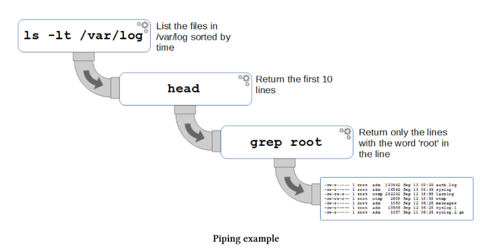

# cat
Komanda cat është një komandë shumë e gjithanshme që zakonisht përdoret për të kryer tre funksione të ndryshme. Ajo mund të shfaqë një skedar në ekran, të bashkojë skedarë të ndryshëm së bashku (t’i konkatenojë) ose të krijojë skedarë të rinj. Kjo është një tjetër komandë bazë që është jashtëzakonisht e dobishme për t’u mësuar kur punohet me Linux nga linja e komandës. Është e thjeshtë, fleksibile dhe e gjithanshme.

    • cat [options] filename filename : Shfaq, bashkon ose krijon skedarë të rinj.

Për shembull: Për të shfaqur skedarin foo.txt në ekran do të përdornim;

    cat foo.txt

Për të shfaqur skedarët foo.txt dhe bar.txt në ekran njëri pas tjetrit do të përdornim;

    cat foo.txt bar.txt

Ose për të bashkuar skedarët foo.txt dhe bar.txt në një skedar të ri të quajtur foobar.txt duke përdorur simbolin e ridrejtimit >;

    cat foo.txt bar.txt > foobar.txt

## Komanda cat
Komanda cat është një mjet thelbësor për t’u përdorur në linjën e komandës në Linux sepse në thelb Linux është një sistem operativ i bazuar në skedarë. Pa një ndërfaqe grafike, duhet të ekzistojë një mekanizëm përmes të cilit krijimi dhe manipulimi i skedarëve tekst të bëhet lehtësisht. Komanda cat është një nga komandat që e bën këtë të mundur. Emri ‘cat’ është shkurtim për ‘catenate’ ose ‘concatenate’ (të dyja janë të pranueshme, por ‘concatenate’ përdoret më shpesh), që do të thotë të lidhësh gjëra në seri. Kjo është një nga përdorimet e saj më të zakonshme, por një përshkrim më i mirë është që komanda cat përdoret për;

    • Shfaqjen e skedarëve tekst në linjën e komandës
    • Bashkimin e një skedari tekst në fund të një tjetri, duke i kombinuar
    • Kopjimin e skedarëve tekst në një dokument të ri

Linux Commands 91

## Opsionet
Opsioni i vetëm që përdoret disi shpesh me cat është opsioni -n që numëron rreshtat e daljes.

## Argumentet dhe Shembujt
Për të shfaqur tekst
Për shembull, për të shfaqur një skedar tekst (foo.txt) në ekran mund të përdorim komandën e mëposhtme;
    
    cat foo.txt

Dalja do të jetë;
    
    pi@raspberrypi ~ $ cat foo.txt
    Kjo rresht është përmbajtja e foo.txt

Siç mund të shohim, përmbajtja e skedarit ‘foo.txt’ dërgohet në ekran (kujdes, nëse skedari është shumë i madh, përmbajtja do të shfaqet si një rrjedhë e gjatë teksti).

Për të bashkuar më shumë se një skedar
Mund të shfaqim po aq lehtë dy skedarë njëri pas tjetrit (të konkatenuar) si më poshtë;

    cat foo.txt bar.txt

Dalja do të jetë;
    
    pi@raspberrypi ~ $ cat foo.txt bar.txt
    Kjo rresht është përmbajtja e foo.txt
    Kjo rresht është përmbajtja e bar.txt

Për të krijuar një skedar të ri
Në vend që skedari të shfaqet në ekran, mund të specifikojmë që cat ta dërgojë përmbajtjen në një skedar të ri (të riemërtuar) si më poshtë;

    cat foo.txt > newfoo.txt

Kjo mund të konsiderohet si një veprim i ngjashëm me kopjimin e skedarit dhe përdor simbolin e ridrejtimit >.

    >> dhe > quhen simbole shtimi (append). Ato përdoren për të shtuar daljen në një skedar dhe jo në ekran. > do të fshijë një skedar nëse ekziston dhe do të krijojë një të ri, prandaj për siguri këshillohet përdorimi i >> kur është e mundur për të shkruar në një skedar pa mbishkruar ose fshirë një ekzistues.

Duke e çuar procesin një hap më tej mund të marrim dy skedarët fillestarë dhe t’i bashkojmë në një skedar të vetëm me;
    
    cat foo.txt bar.txt > foobar.txt

Më pas mund të kontrollojmë rezultatin e bashkimit duke përdorur cat në skedarin e ri si më poshtë;
    
    cat foobar.txt

Dhe dalja do të jetë;
    
    pi@raspberrypi ~ $ cat foobar.txt
    Kjo rresht është përmbajtja e foo.txt
    Kjo rresht është përmbajtja e bar.txt

Pastaj mund të përdorim cat për të shtuar një skedar në një skedar ekzistues duke përdorur operatorin e ridrejtimit >>;

    cat newfoo.txt >> foobar.txt

Këtu përdorim operatorin >> për të shtuar përmbajtjen e skedarit newfoo.txt në skedarin ekzistues foobar.txt.

Përmbajtja përfundimtare e skedarit do të jetë;
    
    pi@raspberrypi ~ $ cat foobar.txt
    Kjo rresht është përmbajtja e foo.txt
    Kjo rresht është përmbajtja e bar.txt
    Dhe kjo është newfoo.txt

Së fundi, mund të përdorim cat për të krijuar një skedar nga e para. Në këtë rast nëse përdorim cat pa një skedar burim dhe e ridrejtojmë në një skedar të ri (këtu newfile.txt), ai do të marrë input nga linja e komandës derisa të shtypet CONTROL-d.

    cat >> newfile.txt

Vazhdo të shkruash
dhe të fusësh informacion derisa...
të shtypim ctrl-d për të përfunduar dhe skedari shkruhet!

Përmbajtja përfundimtare e skedarit do të jetë;
    
    pi@raspberrypi ~ $ cat newfile.txt
    Vazhdo të shkruash
    dhe të fusësh informacion derisa...
    të shtypim ctrl-d për të përfunduar dhe skedari shkruhet!

==============================

# diff
Komanda diff përdoret për të krahasuar dy skedarë ose direktori dhe për të raportuar se cilat janë ndryshimet midis tyre. Është një situatë e zakonshme që të pyesim veten se cili është ndryshimi midis dy skedarëve ose direktorive pothuajse identike dhe kjo komandë i përcakton këto ndryshime.

    • diff [options] from-file to-file : Shfaq ndryshimet midis dy skedarëve

Për shembull, le të supozojmë që kemi dy direktori, ‘dir1’ dhe ‘dir2’. Secila prej këtyre direktorive përmban tre skedarë. ‘dir1’ përmban ‘file_a.txt’, ‘file_b.txt’ dhe ‘file_c.txt’. ‘dir2’ përmban ‘file_a.txt’, ‘file_b.txt’ dhe ‘file_d.txt’.

Për këtë shembull të thjeshtë mund të shohim që ndryshimi midis dy direktorive është që vetëm ‘dir1’ përmban ‘file_c.txt’ dhe vetëm ‘dir2’ përmban ‘file_d.txt’. Mund ta ilustrojmë këtë si më poshtë;

                        │
    ├── dir1
    │ ├── file_a.txt
    │ ├── file_b.txt
    │ └── file_c.txt
    └── dir2
        ├── file_a.txt
        ├── file_b.txt
        └── file_d.txt

Duke përdorur komandën diff si më poshtë mund të krahasojmë direktoritë ‘dir1’ dhe ‘dir2’;

    diff -q dir1 dir2

... dhe rezultatet janë si më poshtë;

    pi@raspberrypi ~ $ diff -q dir1 dir2
    Files dir1/file_a.txt and dir2/file_a.txt differ
    Files dir1/file_b.txt and dir2/file_b.txt differ
    Only in dir1: file_c.txt
    Only in dir2: file_d.txt

Raportimi në këtë rast është në një formë mjaft të qartë dhe të lexueshme për njerëzit. Na tregon jo vetëm që ka skedarë të ndryshëm në secilën direktori, por edhe që kur ka skedarë me të njëjtin emër, na informon që ato janë të ndryshëm nga njëri-tjetri.

Në komandën e mësipërme përdorëm opsionin -q i cili heq ndryshimet individuale midis skedarëve që kanë të njëjtin emër por përmbajtje të ndryshme (përndryshe rezultati mund të ishte pak konfuz).

## Komanda diff
Ka raste në jetën tonë me kompjuter kur kemi bërë ndryshime në skedarë ose direktori dhe gjatë zhvendosjes së tyre ose instalimit të komponentëve të ndryshëm humbasim gjurmët e ndryshimeve që kemi bërë. Kjo mund të ndodhë në programim, administrim sistemi, instalim aplikacionesh ose menaxhim përdoruesish, por cilado qoftë arsyeja, nevojitet të krahasojmë dy gjëra, qofshin skedarë apo direktori, për të parë ndryshimet midis tyre. Këtu hyn në punë komanda diff.

Krahasimi i dy objekteve komplekse nga linja e komandës mund të jetë i vështirë. Nëse ka shumë ndryshime, përdorimi i një ndërfaqeje tekstuale për të kuptuar kontekstin mund të jetë sfidues. Megjithatë, nëse ndryshimet janë të vogla ose krahasimet bëhen shpesh, krahasimi nga linja e komandës bëhet një metodë e shpejtë pasi të mësohemi me të.

Në formën më të thjeshtë, diff analizon dy skedarë dhe shfaq rreshtat që janë të ndryshëm. Mund ta mendojmë daljen si udhëzime për të bërë një skedar të njëjtë me tjetrin.

Në rastin më të thjeshtë, diff krahason përmbajtjen e dy skedarëve from-file dhe to-file.
Nëse të dy janë direktori, diff krahason skedarët përkatës në të dyja, në rend alfabetik. Ky krahasim nuk është rekursiv përveç nëse përdoret opsioni -r.

Si shembull, mund të marrim dy skedarë ‘file_a.txt’ dhe ‘file_b.txt’ si më poshtë;

    file_a.txt                            file_b.txt
    The Raspberry Pi is a mighty machine  The Raspberry Pi is a wonderful machine
    Leanpub has a great range of books    Leanpub has a great range of books
    d3.js is awesome for visualization    d3.js is awesome for visualization
    Linux is a marvel of collaboration    Linux is a marvel of collaboration

Ndryshimi midis skedarëve është në rreshtin e parë ku Raspberry Pi përshkruhet si “mighty” ose “wonderful”.

Mund të ekzekutojmë komandën diff si më poshtë;

    diff file_a.txt file_b.txt

Kjo do të prodhojë këtë rezultat;

    pi@raspberrypi ~/dir1 $ diff file_a.txt file_b.txt
    1c1
    < The Raspberry Pi is a mighty machine
    
    The Raspberry Pi is a wonderful machine

Rreshti i parë i daljes 1c1 tregon që rreshti 1 i from-file duhet të ndryshohet për t’u përputhur me rreshtin 1 të to-file. Nëse do të kishte disa rreshta, ato do të shënoheshin si p.sh. 2,4 që do të thotë nga rreshti 2 deri në 4.

Pjesa tjetër e daljes janë rreshtat e ndryshëm. Për të treguar se nga cili skedar vijnë, çdo rresht fillon me < (nga from-file) ose > (nga to-file). Vijat (---) thjesht ndajnë rreshtat nga skedarë të ndryshëm.

## Opsionet
Ka shumë opsione të ndryshme, por disa nga më të përdorurat janë;

    • -q raporton vetëm nëse skedarët ndryshojnë, jo vetë ndryshimet
    • -c formaton daljen me më shumë kontekst
    • -i injoron ndryshimet në shkronja të mëdha/vogla
    • -r krahason rekursivisht nën-direktoritë

Meqë krahasimi i ndryshimeve në tekst mund të jetë i vështirë, ekziston opsioni -c për më shumë kontekst.

Nëse përdorim këtë opsion;

    diff -c file_a.txt file_b.txt

Do të shohim diçka të tillë;

    pi@raspberrypi ~/dir1 $ diff -c file_a.txt file_b.txt
    *** file_a.txt 2015-09-18 21:10:27.608873625 +0000
    --- file_b.txt 2015-09-18 21:29:26.269130682 +0000
    
    *** 1,4 ****
    ! The Raspberry Pi is a mighty machine
    Leanpub has a great range of books
    d3.js is awesome for visualization
    Linux is a marvel of collaboration
    \ No newline at end of file
    --- 1,4 ----
    ! The Raspberry Pi is a wonderful machine
    Leanpub has a great range of books
    d3.js is awesome for visualization
    Linux is a marvel of collaboration
    \ No newline at end of file

Dy rreshtat e parë tregojnë datën dhe kohën e modifikimit për skedarët (me *** për from-file dhe --- për to-file).

Pastaj ka një ndarës me yje dhe një rresht me numrat 1,4 që tregon që rreshtat që vijojnë janë nga 1 deri në 4 për from-file. Po ashtu pjesa tjetër me 1,4 tregon rreshtat nga 1 deri në 4 për to-file.

==============================

# grep
Komanda grep përdoret për të kërkuar tekst nga skedarë ose nga input i kaluar përmes pipe për rreshta që përmbajnë një përputhje me një model të dhënë. Është një nga komandat më të fuqishme dhe më të gjithanshme në Linux dhe zotërimi i saj lidhet ngushtë me një kuptim të mirë të linjës së komandës.

    • grep [options] pattern [file] : Kërkon tekst dhe përputh modele

Për shembull, komanda e mëposhtme do të kërkojë tekstin “cpus” në skedarin /var/log/dmesg;

    grep cpus /var/log/dmesg

Dalja nga komanda do të duket si më poshtë;

    pi@raspberrypi ~ $ grep cpus /var/log/dmesg
    [ 0.000000] [bcm2709_smp_init_cpus] enter (8620->f3003010)
    [ 0.000000] [bcm2709_smp_init_cpus] ncores=4
    [ 0.053615] [bcm2709_smp_prepare_cpus] enter

Duhet theksuar që secili nga rreshtat e mësipërm përmban tekstin “cpus”.

## Komanda grep
Komanda grep përdoret për të kërkuar tekst nga skedarë ose nga input i kaluar përmes pipe për rreshta që përmbajnë një përputhje me një model të dhënë. Kur gjen një përputhje, ajo kopjon rreshtin ku ndodhet përputhja në daljen standarde (si parazgjedhje), ose në një formë tjetër daljeje nëse është specifikuar me opsione. Modeli mund të jetë një karakter i vetëm, një grup karakteresh, një fjalë ose një fjali.

Emri grep vjen nga një komandë e përdorur në editorin tekstual Unix/Linux ‘ed’ për të kryer një funksion të ngjashëm kërkimi. Komanda ka formën g/re/p, që nënkupton kërkim global për përputhje me një shprehje të rregullt (re) dhe shfaqjen e rreshtave të gjetur në ekran.

Edhe pse grep është menduar për përputhje teksti, ai mund të përputhë karaktere të ndryshme në një rresht. Kufizimi i vetëm është memoria e disponueshme.

## Shprehjet e rregullta
Pjesa re në grep tregon përdorimin e shprehjeve të rregullta për përputhjen e modeleve gjatë kërkimit. Kjo do të thotë që përveç kërkimit të modeleve të drejtpërdrejta (si teksti cpu në shembullin fillestar), mund të përdorim një skemë që lejon fleksibilitet shumë të madh në përputhjet e gjetura.

Për shembull, nëse duam të kërkojmë për tekstin ‘CPU’ ku pas tij mund të ketë një numër nga 0 deri në 3, mund të përdorim komandën;

    grep CPU[0-3] /var/log/dmesg

... e cila do të japë këtë rezultat;

    pi@raspberrypi ~ $ grep CPU[0-3] /var/log/dmesg
    [ 0.053503] CPU0: update cpu_capacity 1024
    [ 0.053577] CPU0: thread -1, cpu 0, socket 15, mpidr 80000f00
    [ 0.113791] CPU1: Booted secondary processor
    [ 0.113851] CPU1: update cpu_capacity 1024
    [ 0.113860] CPU1: thread -1, cpu 1, socket 15, mpidr 80000f01
    [ 0.133710] CPU2: Booted secondary processor
    [ 0.133746] CPU2: update cpu_capacity 1024
    [ 0.133755] CPU2: thread -1, cpu 2, socket 15, mpidr 80000f02
    [ 0.153750] CPU3: Booted secondary processor
    [ 0.153788] CPU3: update cpu_capacity 1024
    [ 0.153797] CPU3: thread -1, cpu 3, socket 15, mpidr 80000f03

Këtu grep ka përdorur karakteret ‘CPU’ si tekst të saktë dhe kllapat katrore tregojnë një shprehje të rregullt që lejon çdo numër nga 0 deri në 3.

## Pipes

Meqë komanda grep mund të funksionojë si filtër, ajo përdoret shpesh për të marrë input nga një komandë tjetër dhe për të prodhuar një dalje të modifikuar nga ky filtër. Ky lidhje komandash realizohet përmes pipes, të cilat shënohen me karakterin |.

Siç sugjeron emri, pipe mund të shihet si një lidhje ku një komandë prodhon një dalje që kalon përmes një “tubi” te komanda tjetër dhe vazhdon deri te dalja përfundimtare.

Për ta demonstruar me shembull, mund të konsiderojmë një grup komandash të lidhura si më poshtë;

Këtu kemi komandën ls që liston përmbajtjen e direktorisë /var/log me listimet të renditura sipas kohës. Kjo më pas kalon te komanda head që do të shfaqë vetëm 10 rreshtat e parë. Pastaj këto 10 rreshta i kalojmë te një komandë grep që filtron rezultatin për të shfaqur vetëm ato rreshta që përmbajnë fjalën ‘root’.

Komanda, siç do të ekzekutohej nga command line, do të ishte si më poshtë;

    ls -lt /var/log | head | grep root

... dhe output-i do të dukej diçka si më poshtë;

    pi@raspberrypi ~ $ ls -lt /var/log | head | grep root
    -rw-r----- 1 root adm 133637 Sep 13 04:01 auth.log
    -rw-r----- 1 root adm 16794 Sep 13 04:01 syslog
    -rw-rw-r-- 1 root utmp 292292 Sep 12 18:58 lastlog
    -rw-rw-r-- 1 root utmp 2688 Sep 12 18:58 wtmp
    -rw-r----- 1 root adm 1050 Sep 12 06:25 messages
    -rw-r----- 1 root adm 18986 Sep 12 06:25 syslog.1
    -rw-r----- 1 root adm 1357 Sep 11 06:25 syslog.2.gz

## Opsionet
Ka një numër të madh opsionesh të disponueshme për përdorim me komandën grep. Për një listë të plotë shkruani man grep në command line. Disa nga më të përdorurat janë;

    • -c Printon numrin e rreshtave që përputhen për çdo file hyrës
    • -E Interpreton pattern-in si një shprehje të rregullt të zgjeruar
    • -n Shton numrin e rreshtit për çdo rresht output-i brenda file-it hyrës
    • -i E bën kërkimin insensitive ndaj shkronjave të mëdha/vogla
    • -o Shfaq vetëm pjesën e rreshtit që përputhet me pattern-in

Nëse duam të gjejmë sa rreshta në input kanë përputhje me pattern-in që kërkojmë, mund të përdorim opsionin -c.

Për shembull nëse duam të gjejmë sa herë shfaqet teksti ‘CPU2’ në file-in /var/log/dmesg do të ekzekutojmë komandën më poshtë;

    grep -c CPU2 /var/log/dmesg

... dhe output-i do të duket diçka si më poshtë;

    pi@raspberrypi ~ $ grep -c CPU2 /var/log/dmesg
    3

Prandaj mund të jemi të sigurt që numri i rreshtave ku shfaqet ‘CPU2’ është 3.

Shell-i bash ku mund të ekzekutojmë komandën grep i konsideron karakteret e mëposhtme si ‘speciale’; ?, +, {, |, ( dhe ). Për këtë arsye, kur përdoren në një shprehje të rregullt duhet të trajtohen ndryshe për t’u përpunuar siç duhet. Ka dy mënyra për ta bërë këtë: ose duke përdorur komandën egrep, ose duke përdorur opsionin -E, të dyja lejojnë përdorimin e shprehjeve të rregullta të zgjeruara.

Nëse provojmë të ekzekutojmë një komandë grep pa opsionin -E do të marrim një error që tregon se komanda nuk e njeh një pjesë të komandës. Për shembull komanda më poshtë;

    grep (CPU1)|(CPU2) /var/log/dmesg

... do të japë një error si ky më poshtë;

    pi@raspberrypi ~ $ grep (CPU1)|(CPU2) /var/log/dmesg
    -bash: syntax error near unexpected token `('

Por nëse përdorim opsionin -E dhe e vendosim pattern-in brenda thonjëzave, do të përfitojmë nga karakteret speciale dhe komanda do të ekzekutohet saktë. Për shembull komanda më poshtë kërkon për CPU1 ose CPU2 në file-in /var/log/dmesg;

    grep -E "(CPU1)|(CPU2)" /var/log/dmesg

Output-i do të duket diçka si më poshtë;

    pi@raspberrypi ~ $ grep -E "(CPU1)|(CPU2)" /var/log/dmesg
    [ 0.113791] CPU1: Booted secondary processor
    [ 0.113851] CPU1: update cpu_capacity 1024
    [ 0.113860] CPU1: thread -1, cpu 1, socket 15, mpidr 80000f01
    [ 0.133710] CPU2: Booted secondary processor
    [ 0.133746] CPU2: update cpu_capacity 1024
    [ 0.133755] CPU2: thread -1, cpu 2, socket 15, mpidr 80000f02

Si alternativë mund t’i ‘escape’-ojmë karakteret speciale duke vendosur një backslash përpara tyre si më poshtë;

    grep -E \(CPU1\)\|\(CPU2\) /var/log/dmesg

Ose mund të përdorim komandën egrep;

    egrep \(CPU1\)\|\(CPU2\) /var/log/dmesg

... ose ...

    egrep "(CPU1)|(CPU2)" /var/log/dmesg

Nëse duam të dimë nga cili numër rreshti vjen output-i, mund të përdorim opsionin -n. Komanda më poshtë do të listojë numrin e rreshtit nga file-i /var/log/dmesg që përputhet me pattern-in CPU2;

    grep -n CPU2 /var/log/dmesg

Si rezultat, output-i do të duket diçka si më poshtë;

    pi@raspberrypi ~ $ grep -n CPU2 /var/log/dmesg
    65:[ 0.133710] CPU2: Booted secondary processor
    67:[ 0.133746] CPU2: update cpu_capacity 1024
    68:[ 0.133755] CPU2: thread -1, cpu 2, socket 15, mpidr 80000f02

Opsioni i fundit që do të shohim do të kthejë vetëm pjesët e rreshtit që përputhen me pattern-in. Për shembull nëse kërkojmë range-in e CPU-ve me pattern-in CPU[0-4] në file-in /var/log/dmesg me komandën më poshtë;

    grep -o CPU[0-4] /var/log/dmesg

... do të marrim një listë përputhjesh si më poshtë;

    pi@raspberrypi ~ $ grep -o CPU[0-4] /var/log/dmesg
    CPU0
    CPU0
    CPU1
    CPU1
    CPU1
    CPU2
    CPU2
    CPU2
    CPU3
    CPU3
    CPU3

==============================

# head
Komanda head është projektuar për të printuar pjesën e parë të një file në ekran. Si parazgjedhje ajo printon 10 rreshtat e parë. Është një program shumë i dobishëm për të kontrolluar shpejt fillimin e një file.

    • head [options] filename(s) : Liston pjesën e parë të një file të specifikuar.

Për shembull nëse duam të listojmë 10 rreshtat e parë të file-it /var/log/dmesg mund ta bëjmë si më poshtë;

    head /var/log/dmesg

Kjo do të japë një output të ngjashëm me këtë;

    pi@raspberrypi ~ $ head /var/log/dmesg
    [ 0.000000] Booting Linux on physical CPU 0xf00
    [ 0.000000] Initializing cgroup subsys cpu
    [ 0.000000] Initializing cgroup subsys cpuacct
    [ 0.000000] Linux version 3.18.7-v7+ (dc4@dc4-XPS13-9333) (gcc version 4.8
    [ 0.000000] CPU: ARMv7 Processor [410fc075] revision 5 (ARMv7), cr=10c5387d
    [ 0.000000] CPU: PIPT / VIPT nonaliasing data cache, VIPT aliasing
    [ 0.000000] Machine model: Raspberry Pi 2 Model B
    [ 0.000000] cma: Reserved 8 MiB at 0x3a800000
    [ 0.000000] Memory policy: Data cache writealloc
    [ 0.000000] On node 0 totalpages: 241664

## Komanda head
Komanda head është projektuar për të kryer detyrën e thjeshtë të leximit të disa rreshtave të parë të një file dhe për t’i shfaqur ato në output (si parazgjedhje, në ekran). Numri i parazgjedhur i rreshtave që komanda printon është 10, por kjo mund të ndryshohet duke përdorur opsionin me vizë (-).

Ajo plotësohet nga komanda tail e cila printon rreshtat e fundit të një file.

## Opsionet
Ka një numër të vogël opsionesh për head. Dy që përdoren më shpesh janë;
    
    • -c[num] printon numrin e parë të byte-ve të file-it (ku 8 byte është një karakter)
    • -n[num] printon numrin e parë të rreshtave të file-it

Në shikim të parë opsioni -c mund të duket pak i çuditshëm, por ai jep një mënyrë shumë të saktë për të printuar një numër të caktuar karakteresh nga një file. Për shembull nëse duam të printojmë 50 karakteret e parë të file-it /var/log/dmesg do të përdorim komandën;

    head -c50 /var/log/dmesg

Output-i do të duket si më poshtë;

    pi@raspberrypi ~ $ head -c41 /var/log/dmesg
    [ 0.000000] Booting Linux on physical pi@raspberrypi ~ $

Mund të shohim që prompt-i i console është vendosur në fund të tekstit të printuar dhe teksti i kthyer është 41 karaktere.

Me opsionin -n, ekziston një shkurtim ku mund të lëmë pa shkruar “n” dhe head do të supozojë automatikisht që nëse vendosim një vizë dhe një numër, duam atë numër rreshtash.

Pra një komandë si më poshtë do të printojë 5 rreshtat e parë të file-it /var/log/dmesg;

    head -5 /var/log/dmesg

Me një rezultat si më poshtë;

    pi@raspberrypi ~ $ head -5 /var/log/dmesg
    [ 0.000000] Booting Linux on physical CPU 0xf00
    [ 0.000000] Initializing cgroup subsys cpu
    [ 0.000000] Initializing cgroup subsys cpuacct
    [ 0.000000] Linux version 3.18.7-v7+ (dc4@dc4-XPS13-9333) (gcc version 4.8
    [ 0.000000] CPU: ARMv7 Processor [410fc075] revision 5 (ARMv7), cr=10c5387d
    pi@raspberrypi ~ $

Për opsionet -c ose -n mund të specifikojmë një shumëzues pranë numrit që rrit numrin e karaktereve ose rreshtave të kthyer. Për shembull b = 512, kB = 1000, K = 1024, MB = 1000x1000, M = 1024x1024, GB = 1000x1000x1000, G = 1024x1024x1024, dhe kështu me radhë për T, P, E, Z dhe Y.

Shembulli më poshtë do të printojë 5000 karakteret e para të file-it /var/log/dmesg.

    head -c5kB /var/log/dmesg

## Argumentet
Nëse duam të shfaqim fillimin e më shumë se një file, thjesht listojmë emrat e tyre njëri pas tjetrit. Për shembull, për të listuar 5 rreshtat e parë të file-ve dmesg dhe syslog (të dy në /var/log) mund të përdorim komandën;

    head -5 dmesg syslog

Rezultati do të duket si më poshtë;

    pi@raspberrypi /var/log $ head -5 dmesg syslog
    ==> dmesg <==
    [ 0.000000] Booting Linux on physical CPU 0xf00
    [ 0.000000] Initializing cgroup subsys cpu
    [ 0.000000] Initializing cgroup subsys cpuacct
    [ 0.000000] Linux version 3.18.7-v7+ (dc4@dc4-XPS13-9333) (gcc version 4.8
    [ 0.000000] CPU: ARMv7 Processor [410fc075] revision 5 (ARMv7), cr=10c5387d
    ==> syslog <==
    Aug 28 06:25:03 raspberrypi rsyslogd: [origin software="rsyslogd"]
    Aug 28 06:39:01 raspberrypi /USR/SBIN/CRON[1490]: (root) CMD
    Aug 28 07:00:01 raspberrypi /USR/SBIN/CRON[1505]: (pi) CMD (/usr/bin/php)
    Aug 28 07:00:41 raspberrypi /USR/SBIN/CRON[1504]: (CRON) info
    Aug 28 07:09:01 raspberrypi /USR/SBIN/CRON[1516]: (root) CMD (/maxlifetime)
    pi@raspberrypi /var/log $

Mund të shohim që në fillim të çdo file printohet emri i tij dhe ka saktësisht 5 rreshta për secilin!

==============================

# less
Komanda less përdoret për të shfaqur file tekst në ekran një faqe në një kohë. Kjo është një komandë e dobishme që në një farë mase ka zëvendësuar komandën more duke qenë se ofron funksionalitet të ngjashëm por më të zgjeruar (E kupton? less is more).

    • less [options] filename : Shfaq file tekst

Për shembull, për të shfaqur faqen e parë në file-in /var/log/dmesg që përmban tekstin ‘cpu_capacity’ mund të përdorim komandën si më poshtë;

    less +/"cpu_capacity" /var/log/dmesg

Kjo do të prodhojë një output të ngjashëm me këtë;
        
        [ 0.053503] CPU0: update cpu_capacity 1024
        [ 0.053577] CPU0: thread -1, cpu 0, socket 15, mpidr 80000f00
        [ 0.053615] [bcm2709_smp_prepare_cpus] enter
        [ 0.053779] Setting up static identity map for 0x536c78 - 0x536cd0
        [ 0.113483] [bcm2709_boot_secondary] cpu:1 started (0) 17
        [ 0.113791] CPU1: Booted secondary processor
        [ 0.113799] [bcm2709_secondary_init] enter cpu:1
        [ 0.113851] CPU1: update cpu_capacity 1024
        [ 0.113860] CPU1: thread -1, cpu 1, socket 15, mpidr 80000f01
        [ 0.133451] [bcm2709_boot_secondary] cpu:2 started (0) 18
        [ 0.133710] CPU2: Booted secondary processor
        [ 0.133716] [bcm2709_secondary_init] enter cpu:2
        [ 0.133746] CPU2: update cpu_capacity 1024
        [ 0.133755] CPU2: thread -1, cpu 2, socket 15, mpidr 80000f02
        [ 0.153508] [bcm2709_boot_secondary] cpu:3 started (0) 17
        [ 0.153750] CPU3: Booted secondary processor
        [ 0.153757] [bcm2709_secondary_init] enter cpu:3
        [ 0.153788] CPU3: update cpu_capacity 1024
        [ 0.153797] CPU3: thread -1, cpu 3, socket 15, mpidr 80000f03
        [ 0.153891] Brought up 4 CPUs
        [ 0.154012] SMP: Total of 4 processors activated (153.60 BogoMIPS).
        [ 0.154045] CPU: All CPU(s) started in SVC mode.
        [ 0.155051] devtmpfs: initialized
        /var/log/dmesg

Ndërsa komanda e mësipërme është identike me komandën fillestare të përdorur në shembullin me more, output-i ndryshon sepse teksti i kërkuar theksohet në output (edhe pse kjo nuk shfaqet në faqen e printuar më sipër).

Dallimi tjetër kryesor është ndërveprimi me faqen gjatë shfaqjes. Ndërsa more është një ‘pager’ që është projektuar për të punuar me një file një faqe në një kohë, nëse përdorim tastet e shigjetave lart dhe poshtë mund të lëvizim në file lart e poshtë në ekran. Madje, nëse disa rreshta janë të gjatë, mund të përdorim shigjetat majtas dhe djathtas për të lëvizur horizontalisht në përmbajtjen e file-it.

## Komanda less
Komanda less njihet kryesisht si një metodë e përmirësuar për të parë file krahasuar me more. Përmirësimi më i dukshëm është mundësia për të lëvizur përpara dhe prapa në file, megjithëse ka shumë funksione të tjera shtesë. Pavarësisht kësaj, disa distribucione Linux përfshijnë vetëm njërën nga këto komanda, sepse more është më e vogël (rreth 2000 rreshta kod krahasuar me 27,000 për less) dhe më e përshtatshme për sisteme më të lehta.

Komanda less përdoret për të shfaqur file tekst një faqe në një kohë dhe konsiderohet pjesë e familjes së ‘pagers’. Është projektuar për të imituar dhe përmirësuar more. Emri vjen nga shprehja “less is more”.

Funksioni kryesor i less është të shfaqë sa më shumë tekst që përshtatet në ekran dhe të lejojë lëvizjen përpara dhe prapa. File mund të lëvizet edhe një rresht në një kohë me tastet e shigjetave.

## Komandat

less përfshin shumë komanda për navigim në një file tekst. Kur shohim [k], k është një numër opsional që vendoset përpara komandës.

    • h ose H : Help. Shfaq përmbledhje komandash
    • [k] <space> ose f : Shfaq k rreshtat e ardhshëm
    • [k] b : Shfaq k rreshtat e mëparshëm
    • [k] z : Shfaq k rreshtat e ardhshëm
    • shigjeta poshtë : lëviz një rresht poshtë
    • shigjeta lart : lëviz një rresht lart
    • [k] <return> : shfaq k rreshta
    • q ose Q : dalje
    • F : shkon në fund të file-it
    • [k] b ose <ctrl>B : lëviz mbrapa
    • = : shfaq info për file
    • [k] /<pattern> : kërkim përpara
    • [k] ?<pattern> : kërkim mbrapa
    • [k] n : kërkim përpara sipas pattern-it të fundit
    • [k] N : kërkim mbrapa sipas pattern-it të fundit
    • &<pattern> : shfaq vetëm rreshtat që përputhen
    • [k] g ose < : shko në fillim
    • [k] G ose > : shko në fund
    • [k] p ose % : shko në përqindje në file

Për shembull, komanda më poshtë fillon shfaqjen e file-it /var/log/dmesg;

    less /var/log/dmesg

Gjatë shfaqjes, shtypja e = tregon info si më poshtë;

    /var/log/dmesg lines 117-139/938 byte 9130/64465 14%

Këtu shohim emrin e file-it, rreshtat që po shfaqen, totalin e rreshtave, pozicionin në byte dhe përqindjen.

Nëse shtypim &cpu do të shfaqen vetëm rreshtat që përmbajnë cpu.

## Opsionet
Disa nga opsionet më të përdorura janë;
    
    • -i injoron shkronjat e mëdha/vogla
    • -I injoron gjithmonë
    • -s bashkon rreshtat bosh
    • -p string kërkon tekst
    • +num fillon nga rreshti num
    • -N shfaq numrat e rreshtave

Për shembull;

    less -p cpu /var/log/dmesg

Output-i do të theksojë tekstin cpu.

Për të parë numrat e rreshtave;

    less -N /var/log/dmesg

Output-i do të jetë si më poshtë;

    12 [ 0.000000] Normal zone: 1888 pages used for memmap
    13 [ 0.000000] Normal zone: 0 pages reserved
    14 [ 0.000000] Normal zone: 241664 pages, LIFO batch:31
    15 [ 0.000000] [bcm2709_smp_init_cpus] enter (8620->f3003010)
    16 [ 0.000000] [bcm2709_smp_init_cpus] ncores=4
    17 [ 0.000000] PERCPU: Embedded 11 pages/cpu @ba05d000 s12864
    /var/log/dmesg  

==============================

# more

Komanda more përdoret për të shfaqur skedarë tekst në ekran një faqe në një kohë. Kjo është një komandë e dobishme që në njëfarë mase është zëvendësuar nga komanda less, e cila ofron funksionalitet të ngjashëm por më të zgjeruar.

    • more [options] filename : Shfaq skedarë tekst

Për shembull, për të shfaqur faqen e parë në skedarin tekst /var/log/dmesg që përmban tekstin “cpu_capacity” mund të përdorim komandën si më poshtë;

    more +/"cpu_capacity" /var/log/dmesg

Kjo do të prodhojë një dalje të ngjashme me këtë;

    [ 0.004116] CPU: Testing write buffer coherency: ok
    [ 0.004231] ftrace: allocating 19969 entries in 59 pages
    [ 0.053503] CPU0: update cpu_capacity 1024
    [ 0.053577] CPU0: thread -1, cpu 0, socket 15, mpidr 80000f00
    [ 0.053615] [bcm2709_smp_prepare_cpus] enter
    [ 0.053779] Setting up static identity map for 0x536c78 - 0x536cd0
    [ 0.113483] [bcm2709_boot_secondary] cpu:1 started (0) 17
    [ 0.113791] CPU1: Booted secondary processor
    [ 0.113799] [bcm2709_secondary_init] enter cpu:1
    [ 0.113851] CPU1: update cpu_capacity 1024
    [ 0.113860] CPU1: thread -1, cpu 1, socket 15, mpidr 80000f01
    [ 0.133451] [bcm2709_boot_secondary] cpu:2 started (0) 18
    [ 0.133710] CPU2: Booted secondary processor
    [ 0.133716] [bcm2709_secondary_init] enter cpu:2
    [ 0.133746] CPU2: update cpu_capacity 1024
    [ 0.133755] CPU2: thread -1, cpu 2, socket 15, mpidr 80000f02
    [ 0.153508] [bcm2709_boot_secondary] cpu:3 started (0) 17
    [ 0.153750] CPU3: Booted secondary processor
    [ 0.153757] [bcm2709_secondary_init] enter cpu:3
    [ 0.153788] CPU3: update cpu_capacity 1024
    [ 0.153797] CPU3: thread -1, cpu 3, socket 15, mpidr 80000f03
    [ 0.153891] Brought up 4 CPUs
    [ 0.154012] SMP: Total of 4 processors activated (153.60 BogoMIPS).
    --More--(35%)

Vini re që përqindja e treguar në fund të ekranit është një tregues se sa përqind e skedarit është shfaqur.

## Komanda more

Komanda more përdoret për të shfaqur skedarë tekst një faqe në një kohë dhe si e tillë mund të konsiderohet pjesë e familjes së “pager”-ave. Është një program relativisht i vjetër dhe me kalimin e kohës janë bërë përmirësime që janë përfshirë në programin less (një lojë fjalësh me shprehjen “less is more”). more lëviz vetëm përpara në një skedar (ndërsa less mund të lëvizë edhe prapa).

Funksioni kryesor i more është të shfaqë aq tekst sa mund të futet në ekran dhe më pas të kalojë në faqen tjetër kur shtypet butoni space, ose të avancojë një rresht kur shtypet enter.

## Komandat

Komanda more përfshin disa komanda që lejojnë kontrollin e navigimit në një skedar tekst. Kur shfaqet [k], k përfaqëson një numër opsional që vendoset përpara komandës.

    • h ose ? : Ndihmë. Shfaq përmbledhjen e komandave
    • [k] <space> : Shfaq k rreshtat e ardhshëm [default = madhësia e ekranit]
    • [k] z : Shfaq k rreshtat e ardhshëm
    • [k] <return> : Shfaq k rreshtat e ardhshëm [default = 1]
    • [k] d ose <ctrl>D : Lëviz k rreshta
    • q ose Q : Dil nga more
    • [k] s : Kalon përpara k rreshta
    • [k] f : Kalon përpara k faqe
    • [k] b ose <ctrl>B : Kthehet mbrapa k faqe
    • = : Shfaq numrin aktual të rreshtit
    • [k] /<shprehje> : Kërkon përputhjen e k-të
    • [k] n : Kërkon përputhjen tjetër
    • v : Hap /usr/bin/vi në rreshtin aktual
    • <ctrl>L : Rifreskon ekranin
    • [k] :n : Kalon te skedari tjetër
    • [k] :p : Kthehet te skedari i mëparshëm
    • :f : Shfaq emrin e skedarit dhe rreshtin aktual
    • . : Përsërit komandën e fundit

Për shembull, nëse ekzekutojmë komandën;

    more /var/log/dmesg

dhe më pas shtypim 6z, do të shfaqen 6 rreshtat e ardhshëm.

## Opsionet

Disa nga opsionet më të përdorura janë;

    • -num : vendos numrin e rreshtave që përbëjnë një faqe
    • -s : bashkon rreshtat bosh të shumëfishtë në një
    • +/"string" : kërkon një tekst specifik në skedar
    • +num : fillon shfaqjen nga rreshti num

Për shembull, nëse vendosim madhësinë e faqes në 3 rreshta;

    more -3 /var/log/dmesg

Dalja do të trajtojë ekranin si 3 rreshta dhe do të shfaqë 3 rreshta për çdo faqe:

    pi@raspberrypi ~ $ more -3 /var/log/dmesg
    [ 0.000000] Booting Linux on physical CPU 0xf00
    [ 0.000000] Initializing cgroup subsys cpu
    [ 0.000000] Initializing cgroup subsys cpuacct
    --More--(1%)

==============================

# tail

Komanda tail është projektuar për të shfaqur pjesën e fundit të një skedari në ekran. Si parazgjedhje, ajo shfaq 10 rreshtat e fundit. Është një program shumë i dobishëm për të kontrolluar shpejt fundin e një skedari.

    • tail [options] filename(s) : Shfaq pjesën e fundit të një skedari të caktuar.

Për shembull, nëse duam të shfaqim 10 rreshtat e fundit të skedarit /var/log/dmesg, mund të përdorim komandën si më poshtë;

    tail /var/log/dmesg

Kjo do të japë një dalje të ngjashme me këtë;

    pi@raspberrypi /var/log $ tail /var/log/dmesg
    [ 4.723858] EXT4-fs (mmcblk0p2): mounted filesystem with ordered data mode.
    [ 4.735464] VFS: Mounted root (ext4 filesystem) readonly on device 179:2.
    [ 4.745366] devtmpfs: mounted
    [ 4.750800] Freeing unused kernel memory: 396K (80767000 - 807ca000)
    [ 5.896875] udevd[175]: starting version 175
    [ 8.192851] EXT4-fs (mmcblk0p2): re-mounted. Opts: (null)
    [ 8.447207] EXT4-fs (mmcblk0p2): re-mounted. Opts: (null)
    [ 11.411899] random: nonblocking pool is initialized
    [ 12.843008] smsc95xx 1-1.1:1.0 eth0: hardware isn't capable of remote
    [ 14.455026] smsc95xx 1-1.1:1.0 eth0: link up, 100Mbps, full-duplex, lpa

## Komanda tail

Komanda tail është krijuar për të lexuar rreshtat e fundit të një skedari dhe për t’i shfaqur ato (zakonisht në ekran). Numri i parazgjedhur i rreshtave është 10, por kjo mund të ndryshohet me opsionin -n.

Ajo plotësohet nga komanda head, e cila shfaq rreshtat e parë të një skedari.

## Opsionet

Ka disa opsione për tail, por tre më të përdorurat janë;

    • -c[num] : shfaq numrin e fundit të byte-ve të skedarit (ku 8 byte ≈ 1 karakter)
    • -n[num] : shfaq numrin e fundit të rreshtave të skedarit
    • -f : shfaq 10 rreshtat e fundit dhe vazhdon të monitorojë skedarin për rreshta të rinj

Në fillim, opsioni -c mund të duket pak i pazakontë, por ai lejon shfaqjen shumë të saktë të një numri të caktuar karakteresh nga fundi i skedarit. Për shembull, për të shfaqur 50 karakteret e fundit:

    tail -c50 /var/log/dmesg

Dalja do të duket kështu;

    pi@raspberrypi /var/log $ tail -c50 /var/log/dmesg
    0 eth0: link up, 100Mbps, full-duplex, lpa 0xC5E1

Shohim që teksti i kthyer ka 41 karaktere.

Me opsionin -n mund të specifikojmë numrin e rreshtave. Për shembull, për 5 rreshtat e fundit:

    tail -n5 /var/log/dmesg

Rezultati;

    pi@raspberrypi /var/log $ tail -n5 /var/log/dmesg
    [ 8.192851] EXT4-fs (mmcblk0p2): re-mounted. Opts: (null)
    [ 8.447207] EXT4-fs (mmcblk0p2): re-mounted. Opts: (null)
    [ 11.411899] random: nonblocking pool is initialized
    [ 12.843008] smsc95xx 1-1.1:1.0 eth0: hardware isn't capable of remote
    [ 14.455026] smsc95xx 1-1.1:1.0 eth0: link up, 100Mbps, full-duplex, lpa

Për opsionet -c dhe -n mund të përdorim shumëzues si:

    b = 512, kB = 1000, K = 1024, MB, M, GB, G, etj.

Shembull për 5000 karaktere:

    tail -c5kB /var/log/dmesg

Opsioni -f është shumë i fuqishëm për monitorim në kohë reale. Ai mban nën vëzhgim skedarin dhe shfaq çdo rresht të ri që shtohet.

## Argumentet

Nëse duam të shfaqim fundin e më shumë se një skedari, mund t’i listojmë njëri pas tjetrit. Për shembull:

    tail -n5 dmesg syslog

Rezultati do të duket kështu;

    pi@raspberrypi /var/log $ tail -n5 dmesg syslog
    ==> dmesg <==
    [ 8.192851] EXT4-fs (mmcblk0p2): re-mounted. Opts: (null)
    [ 8.447207] EXT4-fs (mmcblk0p2): re-mounted. Opts: (null)
    [ 11.411899] random: nonblocking pool is initialized
    [ 12.843008] smsc95xx 1-1.1:1.0 eth0: hardware isn't capable of remote
    [ 14.455026] smsc95xx 1-1.1:1.0 eth0: link up, 100Mbps, full-duplex, lpa
    ==> syslog <==
    Aug 29 02:17:01 raspberrypi /USR/SBIN/CRON[2856]: (root) CMD (run-parts)
    Aug 29 02:39:02 raspberrypi /USR/SBIN/CRON[2870]: (root) CMD (maxlifetime)
    Aug 29 03:00:01 raspberrypi /USR/SBIN/CRON[2900]: (pi) CMD (/usr/bin/php)
    Aug 29 03:00:39 raspberrypi /USR/SBIN/CRON[2899]: (CRON) info (No MTA)
    Aug 29 03:09:01 raspberrypi /USR/SBIN/CRON[2917]: (root) CMD (sessionclean)

Shohim që në fillim të secilit seksion shfaqet emri i skedarit dhe ka 5 rreshta për secilin.

==============================