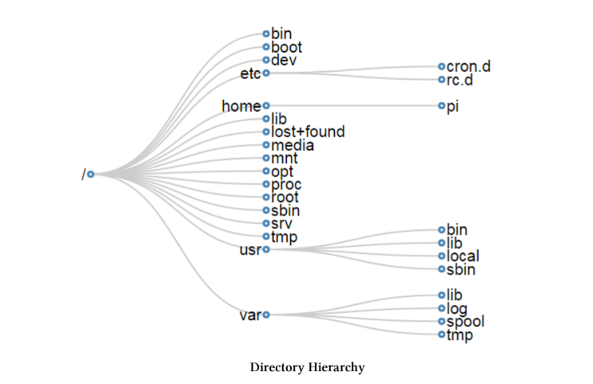

# fdisk

fdisk është një komandë e krijuar për të menaxhuar particionet e diskut. Kjo do të thotë që na lejon të shohim, krijojmë, ndryshojmë madhësinë, fshijmë, modifikojmë, kopjojmë dhe zhvendosim particione në një hard disk.

Le ta fillojmë me një paralajmërim. fdisk është një komandë që riorganizon storage-in tuaj dhe si e tillë mbart rrezik të konsiderueshëm nëse përdoret gabim. fdisk kërkon të ekzekutohet nga një përdorues me privilegje administratori dhe kjo për një arsye të mirë. Ju lutem mos krijoni, fshini ose modifikoni particione nëse nuk e dini çfarë po bëni! Përdorimi i gabuar i fdisk mund të rezultojë në humbje të të dhënave ose dëmtim të sistemit.

Ndërsa do të përshkruajmë disa funksione të fdisk këtu, përshkrimi do të jetë i kufizuar për të kuptuar çfarë mund të tregojë fdisk dhe nëse doni të ndryshoni particionet, rekomandohet të kërkoni këshillë specifike para se ta bëni.

    • fdisk [opsionet] [pajisja] : manipulon tabelat e particioneve.

Kombinimi i vetëm që do të shohim më në detaje është opsioni -l për të listuar tabelat e particioneve të diskut.

    sudo fdisk -l

Programi më pas do të shfaqë informacion për particionet ekzistuese:

    Disk /dev/mmcblk0: 7.4 GiB, 7948206080 bytes, 15523840 sektorë
    Njësitë: sektorë nga 1 * 512 = 512 bytes
    Madhësia e sektorit (logjik/fizik): 512 bytes / 512 bytes
    Madhësia I/O (minimale/optimale): 512 bytes / 512 bytes
    Lloji i etiketës së diskut: dos
    Identifikuesi i diskut: 0xa3a4d77a
    
    Pajisja Boot Fillimi Fundi Sektorë Madhësia Id Tipi
    /dev/mmcblk0p1 8192 131071 122880 60M c W95 FAT32 (LBA)
    /dev/mmcblk0p2 131072 15523839 15392768 7.3G 83 Linux
    
    Disk /dev/sda: 29.5 GiB, 31614566400 bytes, 61747200 sektorë
    Njësitë: sektorë nga 1 * 512 = 512 bytes
    Madhësia e sektorit (logjik/fizik): 512 bytes / 512 bytes
    Madhësia I/O (minimale/optimale): 512 bytes / 512 bytes
    Lloji i etiketës së diskut: dos
    
    Identifikuesi i diskut: 0xb1832c48
    
    Pajisja Boot Fillimi Fundi Sektorë Madhësia Id Tipi
    /dev/sda1 96 61747199 61747104 29.5G c W95 FAT32 (LBA)

Informacioni i mësipërm tregon që kemi dy pajisje storage të lidhura me sistemin:
/dev/mmcblk0 dhe /dev/sda. Jepet shumë informacion si për disqet ashtu edhe për mënyrën si janë ndarë.

Mund të shohim që disku /dev/mmcblk0 ka dy particione. Na thuhet që disku ka 7.4 GiB hapësirë (shkronja “i” tregon që përdoret baza 1024 dhe jo 1000, gjë që është normale). Informacioni mbi sektorët është një mënyrë për të përfaqësuar kapacitetin.

Particionet kanë ID që tregojnë tipin e tyre dhe gjithashtu një emër të lexueshëm nga njeriu (p.sh. Linux, FAT32, etj.).

Ka shumë tipe të ndryshme particionesh, por zakonisht do të shihni:

    ‘7’, ‘b’, ‘c’ për media të lëvizshme
    ‘82’ / ‘83’ për Linux

Disqet mund të ndahen në një ose më shumë particione logjike. Këto ndarje përshkruhen në tabelën e particioneve që ndodhet në sektorin 0 të diskut. fdisk lejon editimin e kësaj tabele dhe për këtë arsye ka potencial të ndikojë ndjeshëm në funksionimin e storage-it.

Particionet mund të kenë madhësi dhe filesysteme të ndryshme, kështu që një disk mund të përdoret për shumë qëllime.

Linux ka nevojë për të paktën një particion për sistemin root dhe zakonisht një tjetër për swap.

fdisk është një mjet thelbësor për krijimin dhe menaxhimin e particioneve, por ndryshimet nuk bëhen aktive derisa të ruhen. Për ta bërë një particion të përdorshëm, duhet të formatohet me mkfs.

Për të punuar në mënyrë interaktive me një disk:

    sudo fdisk /dev/sda

Mesazhi që shfaqet:

    Ndryshimet do të qëndrojnë vetëm në memorie derisa t’i ruani.
    Kujdes para se të përdorni komandën write.

Komandat kryesore:

    m : ndihmë
    d : fshi particion
    n : krijo particion të ri
    p : shfaq tabelën
    t : ndrysho tipin
    w : ruaj dhe dil
    q : dil pa ruajtur

Për të krijuar një particion të ri përdoret ‘n’, pastaj zgjidhet tipi (primary ose extended), numri, sektori fillestar dhe ai përfundimtar.

Pas krijimit:
“Created a new partition 1 of type 'Linux' and of size 29.5 GiB.”

Nëse rezultati është i dëshiruar, ndryshimet ruhen në tabelën e particioneve.

==============================

# mkfs
Komanda mkfs përdoret për të krijuar një file system në një particion Linux. Ky është procesi i aplikimit të formatimit në nivel të lartë në një particion në mënyrë që të vendoset një file system i caktuar dhe storage të bëhet gati për përdorim. Ky është një hap i rëndësishëm në shtimin e storage, por kërkon kujdes sepse çdo komandë që ndryshon storage mund të sjellë rrezik. Përdorimi i gabuar mund të çojë në humbje të të dhënave. Siç pritet për këtë lloj komande, duhet të jemi përdorues administrator për ta ekzekutuar.

    • mkfs [options] device : formaton një particion me një file system

Përdorimi i mësipërm është pak i thjeshtuar nga ai në man pages, por përfaqëson përdorimin bazë.

Pasi kemi identifikuar ose krijuar një particion me fdisk, mund ta formatojmë si më poshtë (duke supozuar që particioni është /dev/sda1 dhe përdor file system default ‘ext2’):
    
    sudo mkfs /dev/sda1

Në rastin tonë kemi tashmë një particion të formatuar në /dev/sda1 dhe marrim këtë mesazh:

    mke2fs 1.42.12 (29-Aug-2014)
    /dev/sda1 contains a vfat file system labelled 'SP UFD U2'
    Proceed anyway? (y,n)

Pasi të vazhdojmë nga kjo pikë do të bëjmë ndryshime serioze në storage!

Nëse vendosim të vazhdojmë dhe shtypim ‘y’, procesi fillon duke shfaqur detaje dhe duke shkruar inode tables:

    Creating filesystem with 7718388 4k blocks and 1933312 inodes
    Filesystem UUID: 5d930bad-3024-476b-8673-4b450855f537
    Superblock backups stored on blocks:
    32768, 98304, 163840, 229376, 294912, 819200, 884736, 1605632, 2654208,
    4096000
    Allocating group tables: done
    Writing inode tables: 177/236

Pas kësaj fillon shkrimi i superblock dhe informacionit të file system:

    Writing superblocks and filesystem accounting information: 10/236

Kini parasysh që ndonjëherë duket sikur procesi ka ngecur. Duhet pak durim (p.sh. disa minuta) dhe zakonisht përfundon.

Pasi të përfundojë, mbetet vetëm ta mount-ojmë particionin dhe mund të përdorim storage-in e ri.

## Komanda mkfs
File systems përdoren për të kontrolluar si ruhen të dhënat në disqe dhe particione, çfarë informacioni lidhet me to dhe si kontrollohet aksesi. File systems përmirësohen vazhdimisht për më shumë funksionalitet dhe efikasitet.

Komanda mkfs përdoret për të formatuar particione në një lloj të caktuar file system. Emri vjen nga “make file system”. mkfs është një “front-end” për disa komanda specifike për file system-e të ndryshme. Jo të gjitha janë të disponueshme në çdo distribucion.

Mund të shohim cilat file systems janë të disponueshme duke kontrolluar /sbin:
    
    ls /sbin/mk* -l

Kjo do të tregojë një listë me komandat e disponueshme për file system-et.

Opsioni kryesor që duhet të dimë është -t që specifikon tipin e file system.

Default është ext2, por mund të përdorim edhe të tjera:

    • ext3 : sudo mkfs -t ext3 device
    • ext4 : sudo mkfs -t ext4 device
    • msdos : sudo mkfs -t msdos device
    • bfs : sudo mkfs -t bfs device

Disa pika për file system-et kryesore në Linux:

    • ext2 :
    – mbështet deri në 4TB
    – superblock rrit performancën
    – rezervon 5% të diskut për root
    – përdoret shpesh në USB sepse nuk ka journaling dhe bën më pak shkrime

    • ext3 :
    – ka të gjitha veçoritë e ext2 + journaling
    – kompatibil me ext2
    – rikuperon më shpejt pas ndërprerjes së energjisë

    • ext4:
    – mbështet file system më të mëdha
    – kontroll më i shpejtë
    – timestamps më të sakta
    – journaling me checksums
    – shpërndarje automatike e hapësirës për të shmangur fragmentimin

==============================

# mount
Pasi një pajisje storage (CD Rom, hard disk, USB stick, etj.) është particionuar për përdorim, ne duhet të përdorim komandën mount për ta montuar atë në një file system, duke e bërë të aksesueshme dhe duke e lidhur me një strukturë ekzistuese të direktorive. Kjo komandë rrallë kërkohet në sisteme me GUI që e automatizojnë procesin, por për konfigurim manual të file system-it ose për troubleshooting, mount është shumë i dobishëm.

    • mount [options] type device directory : monton storage në file system

Për shembull, pasi të fusim një USB mund të përdorim këto komanda për ta montuar:

    sudo mkdir /mnt/usbdata
    sudo mount /dev/sda1 /mnt/usbdata

Procesi bëhet në dy hapa:

    1.Fillimisht krijojmë një directory bosh me mkdir të quajtur usbdata, që shërben si vend ku do montohet storage
    2.Pastaj montohet pajisja /dev/sda1 në atë directory (/mnt/usbdata)

Nga këtu mund të futemi në directory me cd dhe të përdorim storage-in.

## The mount command
Komanda mount është një nga ato që, kur fillon ta përdorësh me siguri dhe rregullisht, tregon që je në një nivel të mirë në administrimin e Linux.

File system-i në Linux është një hierarki direktorish që përdoret për të organizuar file-t në një rend logjik, i ngjashëm me sa vijon;

Kur montojmë një storage të ri, krijojmë një directory për ta lidhur me pikën e montimit. Zakonisht përdoret direktoria “/mnt”, por mund të lidhet edhe nga vende të tjera. Në këtë mënyrë storage mund të përdoret në mënyrë fleksibël.

Për të montuar një storage të ri duhet të dimë: llojin e storage, ku paraqitet si device në sistem dhe ku do ta montojmë.

Ka shumë lloje file system që mund të mbështeten (si p.sh. ext4, ntfs, vfat, etj.). Nuk zgjedhim ne tipin gjatë mount-it, ai varet nga mënyra si është formatuar storage.

Komanda mount shpesh e detekton automatikisht file system-in. Më të zakonshmet janë:

    • ext4 – më i përdoruri në Linux
    • ext3 – version i mëparshëm i Linux
    • ntfs – përdoret në Windows për disqe më të mëdha
    • vfat – përdoret shpesh për USB dhe disqe të vegjël

Nëse tipi nuk detektohet automatikisht, mund të ndodhë sepse:

    • mungojnë mjetet për atë file system
    • është zgjedhur particioni i gabuar
    • storage është i dëmtuar ose i paformatuar

Kur shtohet një pajisje e re, ajo shfaqet në /dev. Pajisjet zakonisht quhen sda, sdb, etj. Particionet emërtohen sda1, sda2, etj.

Për të parë pajisjet përdoret:

    sudo fdisk -l

Para mount-it, duhet të krijohet një mount point (directory bosh), zakonisht në /mnt:

    sudo mkdir /mnt/usbdata
    sudo mount /dev/sda1 /mnt/usbdata

Pas kësaj mund të hyjmë në directory dhe të përdorim storage-in.

Mund të kontrollojmë mount-et aktive duke thjesht shkruar:

    mount

Do të shfaqen të gjitha storage-t e montuara, p.sh:

    /dev/sda1 on /mnt/data type vfat

Kjo tregon device, vendin e montimit dhe llojin e file system.

Gjithashtu ekziston /etc/fstab (file system table), që përdoret për të automatizuar mount-in gjatë ndezjes së sistemit. Ai mund të konfigurohet që disa storage të montohen automatikisht ose jo.
Komanda:

    mount -a

monton të gjitha file system-et e përshkruara në fstab.

==============================

# umount
Komanda umount përdoret për të çmontuar (hequr) një file system nga Linux. Ky është procesi i kundërt me mount. Pasi një pajisje storage (CD, hard disk, USB, etj.) është montuar dhe përdorur, përdorim umount për ta hequr nga sistemi i file-it.

Çmontimi i sigurt është i rëndësishëm sepse siguron që të gjitha proceset e shkrimit në disk të përfundojnë siç duhet dhe redukton rrezikun e humbjes së të dhënave.

    • umount [options] device dhe/ose directory : çmonton storage nga file system

Për shembull, nëse kemi montuar një USB nga /dev/sda1 në /mnt/usbdata, mund ta çmontojmë kështu:

    sudo umount /mnt/usbdata

Komanda umount është procesi i kundërt i mount.

Për të çmontuar një filesystem, mund të përdorim ose device-in ose mount point-in, sepse të dy janë unikë për atë storage.

Këto komanda janë të njëjta:

    sudo umount /dev/sda1
    sudo umount /mnt/usbdata
    sudo umount /dev/sda1 /mnt/usbdata

Filesystem-et zakonisht çmontohen automatikisht kur sistemi fiket normalisht. Por ndonjëherë duhet t’i çmontojmë manualisht, për shembull kur heqim një USB. Nëse e heqim pa bërë umount, të dhënat mund të mos ruhen si duhet.

Ndonjëherë mund të shfaqet gabimi “filesystem is busy”, që do të thotë se është ende në përdorim nga ndonjë proces. Kjo ndodh nëse një file është i hapur ose një dritare po e përdor atë storage. Zgjidhja është të mbyllen proceset ose dritaret që e përdorin.

==============================

==============================

==============================

==============================

==============================