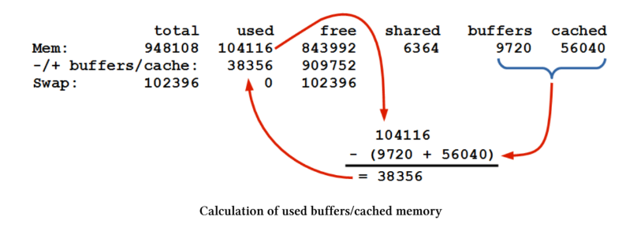
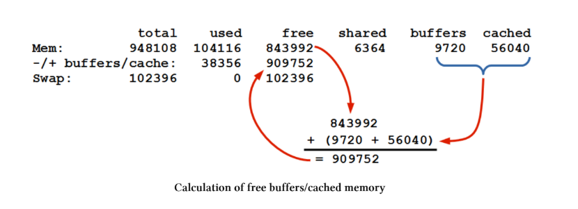

# date
Komanda date mund të përdoret për të shfaqur datën/kohën që kompjuteri është i vendosur ose për të vendosur datën/kohën e sistemit. Kjo komandë mund të jetë e dobishme thjesht për të treguar datën ose orën, ose për një qëllim më serioz për të vendosur konfigurimin e sistemit.

    • date [opsione] +format : shfaq ose vendos datën/kohën

Përdorimi më i thjeshtë i komandës date bëhet duke e ekzekutuar vetë komandën:

    date
    Kjo do të japë diçka si më poshtë:
    Sat Jan 23 15:26:14 NZDT 2016

Në thelb, komanda date ka një model të thjeshtë përdorimi, por shoqërohet me disa opsione të shumta formatimi.

## Komanda date
Komanda date quhet kështu për shkak të lidhjes së saj me datën dhe kohën. Përdorimi i saj është i fokusuar në disa funksione kryesore. E para është që mund të përdoret për të treguar kohën. Kjo mund të formatohet sipas mënyrës që zgjedh përdoruesi. Funksioni i dytë kryesor është që lejon përdoruesin të vendosë datën/kohën e sistemit.

Lidhur me shfaqjen dhe vendosjen e datës/kohës është edhe formatimi i tyre në komandë. Formatimi i shfaqjes mund të ndryshohet duke përdorur shenjën plus (+) dhe disa udhëzime formatimi në formë opsionesh. Për shembull, për të shfaqur vetëm muajin aktual me emrin e plotë mund të përdoret %B si më poshtë:

    date +"%B"
    Kjo do të japë:
    January

Këto opsione mund të kombinohen për të krijuar kontekst më kuptimplotë. Për shembull:

    date +"This is week %U of %Y"

Do të shfaqë tekstin “This is week ” të ndjekur nga numri i javës së vitit dhe pastaj “ of ” dhe vitin. Si më poshtë:

    This is week 04 of 2016

Lista e kodeve të formatimit është si më poshtë:

    • %% një % literal
    • %a emri i shkurtuar i ditës (p.sh. Sun)
    • %A emri i plotë i ditës (p.sh. Sunday)
    • %b emri i shkurtuar i muajit (p.sh. Jan)
    • %B emri i plotë i muajit (p.sh. January)
    • %c data dhe ora (p.sh. Thu Mar 3 23:05:25 2005)
    • %C shekulli (p.sh. 20)
    • %d dita e muajit
    • %D data (format m/d/y)
    • %F data e plotë (YYYY-MM-DD)
    • %H ora (00–23)
    • %I ora (01–12)
    • %m muaji (01–12)
    • %M minutat (00–59)
    • %S sekondat (00–60)
    • %Y viti
    (dhe shumë të tjera si në listë)

Sepse si parazgjedhje numrat mbushen me zero, ekzistojnë disa opsione shtesë:

    • - mos mbush me zero
    • _ mbush me hapësirë
    • 0 mbush me zero
    • ^ përdor shkronja të mëdha nëse është e mundur
    • # ndrysho rastin

Për shembull:

    date +"This is week %-U of %Y"

Do të shfaqë:

    This is week 4 of 2016

## Opsionet

• -d shfaq një datë të specifikuar
• -s vendos kohën e sistemit
• -u shfaq/set UTC (koha universale)

## Shembuj:

    date -d "4 JUL 2001" → shfaq datën e caktuar
    date -d "next thursday" → shfaq të enjten e ardhshme
    date -d "yesterday" → dje

Vendosja e kohës:

    sudo date -s "24 Jan 2016 07:12:00"

UTC (Coordinated Universal Time) është standardi global i kohës. Më parë quhej GMT. Përdoret në aviacion dhe sisteme globale sepse është i njëjtë kudo në botë.

Mund të shfaqet edhe UTC me opsionin -u.

==============================

df

Komanda df përdoret për të raportuar sasinë e hapësirës së lirë të disponueshme në sistemet e skedarëve (file systems). Kjo është një komandë shumë e rëndësishme për të kuptuar burimet e disponueshme në një sistem dhe është një nga komandat kryesore që përdoret për diagnostikimin e problemeve në sistemet ku hapësira e ruajtjes mund të jetë e kufizuar.

    • df [opsionet] file : shfaq sasinë e hapësirës së lirë në sistemet e skedarëve.

Për shembull, përdorimi i komandës df pa asnjë opsion mund të japë një rezultat si më poshtë:

    Filesystem  1K-blocks  Used  Available  Use%  Mounted on
    /dev/root   7549084    1055236  6159348   15%   /
    devtmpfs    469748     0        469748    0%    /dev
    tmpfs       474052     0        474052    0%    /dev/shm
    tmpfs       474052     6356     467696    2%    /run
    tmpfs       5120       4        5116      1%    /run/lock
    tmpfs       474052     0        474052    0%    /sys/fs/cgroup
    /dev/mmcblk0p1 61384   20296    41088     34%   /boot

Kolona e parë tregon emrin e ndarjes së diskut ashtu siç shfaqet në direktoriumin /dev. Kolonat e tjera tregojnë hapësirën totale, blloqet e përdorura dhe blloqet e disponueshme. Kolona Use% tregon përqindjen e përdorimit të sistemit të skedarëve.

Kolona e fundit tregon pikën e montimit (mount point) të sistemit të skedarëve. Kjo është direktoria ku sistemi i skedarëve është i lidhur brenda pemës së sistemit. Vini re se ndarja root gjithmonë ka mount point /.

## Komanda df

Komanda df vjen nga shkurtesa “disk free” dhe bën pikërisht këtë: raporton sasinë e hapësirës së përdorur dhe të lirë në sistemet e skedarëve të montuar.

Në informatikë është e zakonshme që nevojat për hapësirë rriten gjithmonë, prandaj është shumë e rëndësishme të kemi mjete që na tregojnë sa hapësirë kemi në çdo pajisje ruajtjeje. Për këtë arsye, njohja e mirë e komandës df dhe shoqërueses së saj du është shumë e rekomanduar.

Një nga opsionet më të dobishme është -h, që shfaq hapësirën në format të lexueshëm për njeriun:

    df -h

Shembull rezultati:

    Filesystem      Size  Used  Avail  Use%  Mounted on
    /dev/root       7.2G  1.1G  5.9G   15%   /
    devtmpfs        459M  0     459M   0%    /dev
    tmpfs           463M  0     463M   0%    /dev/shm
    tmpfs           463M  6.3M  457M   2%    /run
    tmpfs           5.0M  4.0K  5.0M   1%    /run/lock
    tmpfs           463M  0     463M   0%    /sys/fs/cgroup
    /dev/mmcblk0p1  60M   20M   41M    34%   /boot

Këtu madhësitë shfaqen në kilobyte (K), megabyte (M) dhe gigabyte (G).

Mund të shohim gjithashtu hapësirën për një pajisje të caktuar duke dhënë një direktori:

    df /

ose:

    df /home

Në këtë rast, rezultati është i njëjtë sepse /home dhe / ndodhen në të njëjtën pajisje (/dev/root).

Komanda df merr shumicën e informacionit nga superblock-u i sistemit të skedarëve, i cili përmban të dhëna për karakteristikat e tij. Për këtë arsye, ajo nuk merr parasysh gjithmonë hapësirën e zënë nga skedarët e hapur në mënyrë plotësisht të saktë. Si rezultat, df nuk jep gjithmonë një pasqyrë 100% të saktë të hapësirës së lirë.

==============================

# du

Komanda du përdoret për të raportuar sasinë e hapësirës së përdorur nga skedarët dhe direktoriumet. Kjo është një komandë shumë e rëndësishme për të kuptuar burimet e sistemit dhe është një nga komandat kryesore për zgjidhjen e problemeve në sistemet ku hapësira e ruajtjes është e kufizuar.

    • du [opsionet] file : shfaq sasinë e hapësirës së përdorur në skedarë dhe direktoriume.

Për shembull, përdorimi i komandës du për të parë hapësirën e përdorur në direktoriumin /var/log dhe nën-drejtoriumet e tij:

    du /var/log

jep një rezultat si më poshtë:

    12 /var/log/fsck
    4 /var/log/ntpstats
    48 /var/log/apt
    4 /var/log/samba
    2932 /var/log

Kolona e parë tregon numrin e blloqeve të diskut të përdorura në çdo direktorium (duke kujtuar se /var/log është direktoriumi bazë dhe të tjerët janë nën-drejtoriume të tij). Kolona e dytë tregon emrin e direktoriumit.

## Komanda du

Komanda du vjen nga shkurtesa “disk usage” dhe tregon madhësinë e direktoriumeve, pemëve të direktoriumeve dhe skedarëve.

Ashtu si me çdo sistem, nevoja për hapësirë ruajtjeje rritet gjithmonë, prandaj është e rëndësishme të kemi mjete që na tregojnë sa hapësirë kemi në pajisjet tona. Për këtë arsye, njohja e mirë e komandës du dhe shoqërueses së saj df është shumë e rëndësishme.

## Opsionet më të dobishme të du:

    -h → shfaq rezultatet në format të lexueshëm për njeriun
    -s → jep vetëm totalin e përdorimit të diskut
    --time → shfaq kohën e fundit të modifikimit
Shembull me -h (format i lexueshëm)

    du -h /var/log

Rezultati:

    12K /var/log/fsck
    4.0K /var/log/ntpstats
    48K /var/log/apt
    4.0K /var/log/samba
    3.1M /var/log

Këtu shohim se madhësitë shfaqen në:

    K (kilobyte)
    M (megabyte)
    G (gigabyte)
    T (terabyte)
    P (petabyte)
    E (exabyte)
    Z (zettabyte)
    Y (yottabyte)

(Për shembull, yottabyte është një njësi jashtëzakonisht e madhe: 1,000,000,000,000,000,000,000,000 byte.)

Shembull me -s (total i përmbledhur)

    du -s /var/log

Rezultati:

    3152 /var/log

Shembull me --time

Ky opsion tregon edhe kohën e fundit të modifikimit të çdo direktoriumi:

    du --time /var/log

Shembull rezultati:

    12 2015-11-22 07:51 /var/log/fsck
    4 2015-11-02 17:31 /var/log/ntpstats
    48 2016-01-16 16:41 /var/log/apt
    4 2015-03-08 01:13 /var/log/samba
    3152 2016-01-23 07:52 /var/log

## Kufizime të komandës du

    1.Madhësitë që raporton du janë përafërsi, jo numra absolutisht të saktë.
    2.Mund të mos ketë akses në disa skedarë ose direktoriume pa leje leximi.
    3.Në disa raste mund të kërkohet përdorimi i sudo ose privilegje administratori.

Në përgjithësi, edhe pse du nuk jep gjithmonë shifra 100% të sakta, është shumë e dobishme për të gjetur se ku po përdoret hapësira në sistem.

==============================

# free

Komanda free tregon sasinë totale të memories fizike (RAM) dhe memories swap që është e lirë dhe e përdorur në sistem, si dhe buffer-at dhe memorien e përbashkët (shared memory) të përdorura nga kernel-i.

Në të njëjtën mënyrë si komandat df dhe du tregojnë përdorimin e hapësirës në disk, free tregon si përdoret memoria RAM në sistem. Kjo është një komandë shumë e rëndësishme për diagnostikimin e problemeve dhe kuptimin e performancës së sistemit.

    • free [opsionet] : shfaq informacion mbi memorien e lirë dhe të përdorur në sistem.

## Shembull:
    free

Rezultati:

                 total   used   free   shared  buffers  cached
    Mem:         948108  104116 843992  6364    9720     56040
    -/+ buffers/cache:   38356  909752
    Swap:        102396  0      102396

Ky rezultat tregon sasinë totale të memories fizike dhe swap, si dhe buffer-at e përdorur nga kernel-i.

Çfarë përfaqëson çdo rresht:

### Mem

Rreshti Mem tregon memorien fizike (RAM) të disponueshme në sistem.

### Buffers / Cache
Buffer: pjesë e memories që përdoret për të ruajtur përkohësisht të dhëna që dërgohen ose merren nga pajisje të jashtme (disk, rrjet, printer, etj.).
Cache: memorje që ruan të dhëna të përdorura shpesh për akses më të shpejtë.

Cache mund të përdoret disa herë, ndërsa buffer zakonisht përdoret përkohësisht vetëm një herë.

### Swap

Swap është hapësirë në hard disk që përdoret kur RAM-i mbushet. Sistemi e përdor për të shmangur mungesën e memories.

Nëse swap përdoret shpesh, mund të tregojë që sistemi ka nevojë për më shumë RAM.
Përdorimi i swap-it është më i ngadaltë se RAM-i.

    ⚠️ Kujdes: edhe kur swap përdoret vetëm për pak kohë, vlera e “used” mund të mbetet e lartë, gjë që mund të krijojë konfuzion.

### Total

Tregon sasinë totale të memories së disponueshme (RAM + swap).

### Used

Kjo është pjesa më e ndërlikuar për t’u kuptuar:

Përfshin memorien e përdorur nga aplikacionet
memorien e përkohshme (cache + buffer)

Kjo do të thotë që jo e gjithë memoria “used” është realisht e zënë, sepse cache mund të lirohet nëse nevojitet.

### Free

Tregon memorien që është plotësisht e lirë dhe gati për përdorim.

### Shared

Tregon memorien që ndahet midis disa proceseve për komunikim.

### Buffers

Tregon memorien e përdorur nga kernel-i për buffer cache, për të përshpejtuar operacionet me diskun.

### Cached

Tregon memorien e përdorur për cache nga kernel-i për akses më të shpejtë të të dhënave.

Kjo memorie mund të lirohet nëse aplikacionet kanë nevojë.

Rreshti i rëndësishëm:

    -/+ buffers/cache

Ky rresht është më i dobishmi për të kuptuar realisht:

    - sa memorie po përdorin aplikacionet
    - sa memorie është realisht e lirë për përdorim

Përmbledhje e thjeshtë:

    free → memoria e lirë
    used → memoria në përdorim (përfshin cache/buffer)
    buffers/cache → memorje e përkohshme që mund të lirohet
    swap → memorie në disk kur RAM mbaron

## Opsionet e komandës free

Ndër opsionet e shumta që ka komanda free, më i përdoruri është -h, i cili shfaq memorien në format të lexueshëm për njeriun (human readable).

Shembull:

    free -h

Rezultati:
    
                  total   used   free   shared  buffers  cached
    Mem:          925M    101M   823M   6.2M    10M      54M
    -/+ buffers/cache:    36M    888M
    Swap:         99M     0B     99M
    Çfarë tregon ky format?

Këtu madhësitë shfaqen në mënyrë të thjeshtuar:

    M = megabyte
    K = kilobyte
    G = gigabyte
    T = terabyte
    B = byte
    Pse ndryshon “free” nga memoria reale?

Komanda free zakonisht tregon pak më pak memorie totale sesa ajo reale e sistemit, sepse:

Kernel-i i sistemit gjithmonë qëndron në RAM gjatë funksionimit dhe nuk mund të lirohet.
Disa pjesë të memories janë të rezervuara për funksione të veçanta të sistemit ose hardware-it.
Sistemi mund të rezervojë memoria për arkitekturën e pajisjes ose procese të brendshme.

### Përmbledhje e thjeshtë:
free -h → shfaq memorien në format të lexueshëm (M, G, etj.)
Memoria totale duket pak më e vogël sepse një pjesë është e rezervuar për kernel-in dhe sistemin
Buffer dhe cache mund të lirohen kur nevojitet nga aplikacionet

==============================

==============================

==============================

==============================

==============================